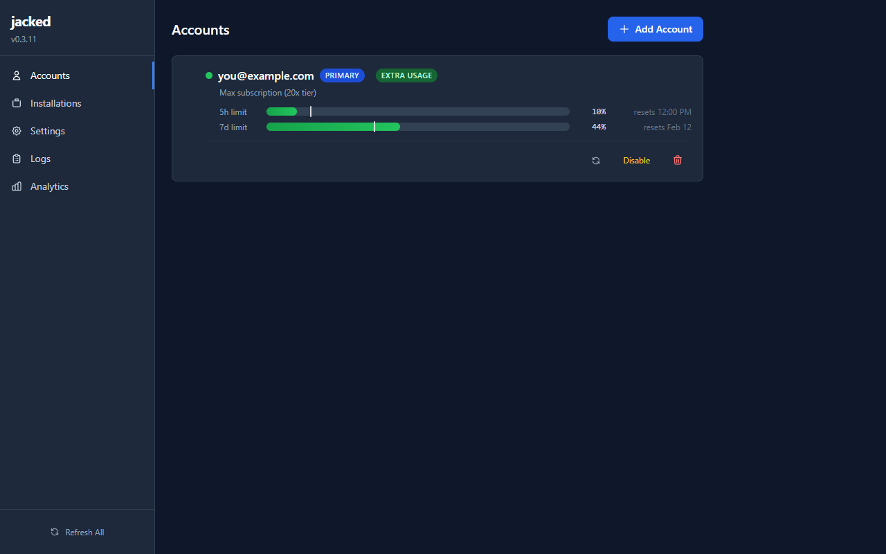
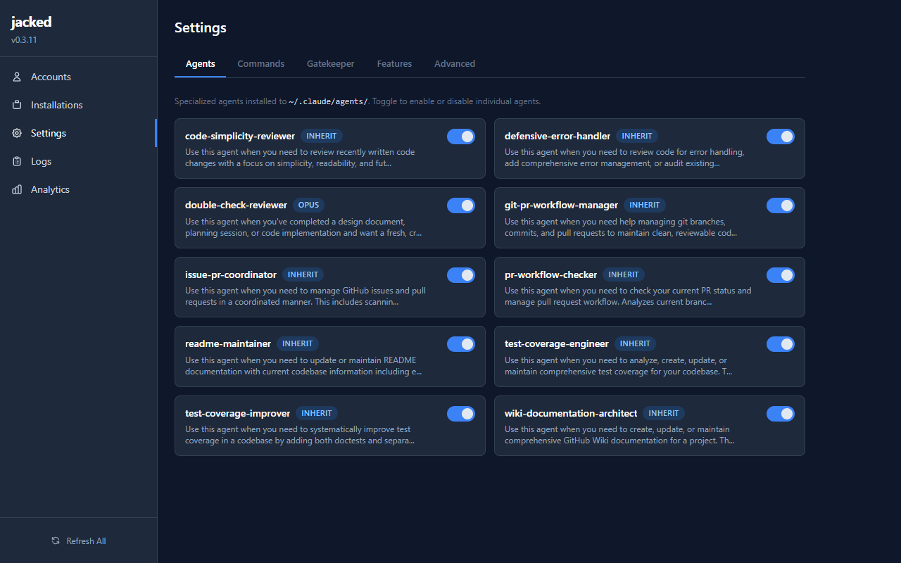
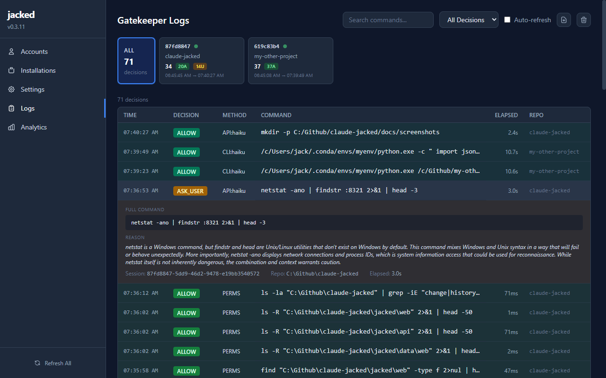
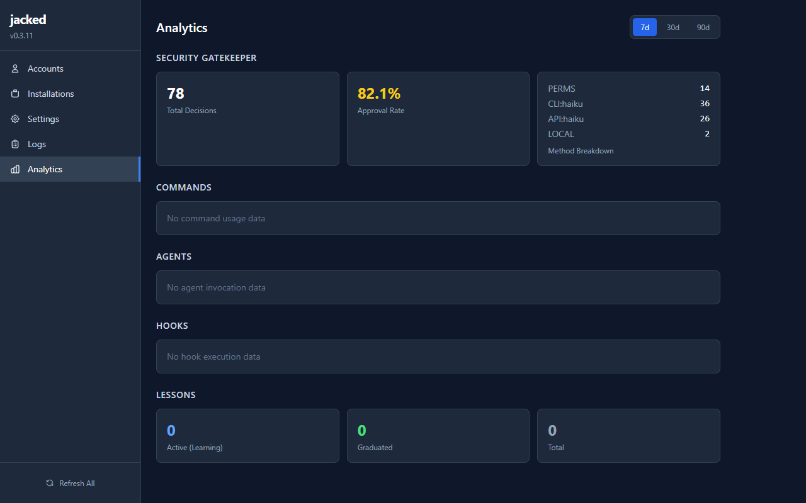
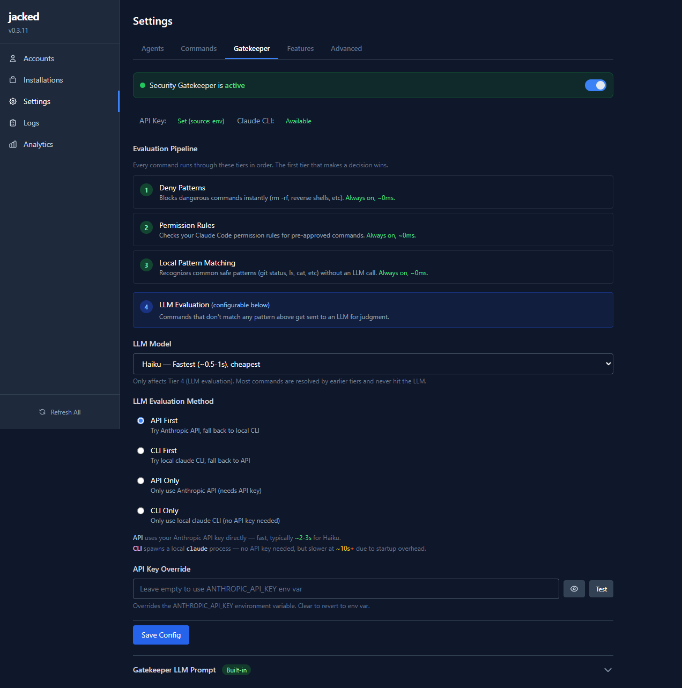
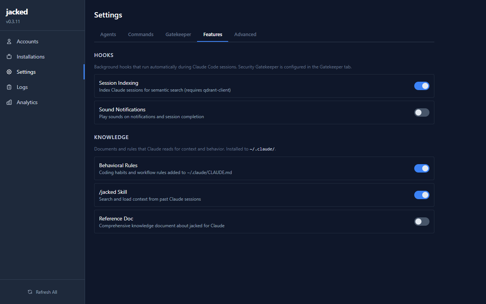
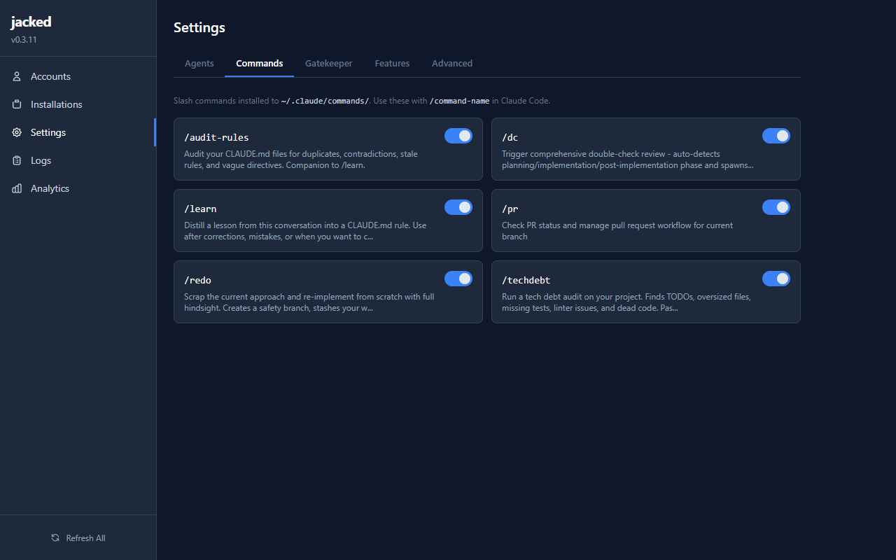

# claude-jacked

**A control panel for Claude Code.** Smart reviewers, security automation, session search, and a web dashboard to manage it all — without touching a config file.



---

## What You Get

- **Stop clicking "approve" on every terminal command** — Claude Code asks permission for every bash command it runs. The security gatekeeper handles the safe ones automatically, so you only get interrupted when something is actually risky.
- **Catch bugs before they ship** — Automatic code quality checks review your work for security holes, complexity, missing error handling, and test gaps. 10 built-in reviewers, always watching.
- **Find any past conversation** — Search your Claude history by describing what you were working on. Works across machines, works across teammates. *(requires [search] extra)*
- **Manage everything from a web dashboard** — Toggle features on and off, configure the security system, monitor decisions, track usage — all from your browser. No config files, no terminal commands.

---

## Quick Start

### Option 1: Let Claude Install It

Paste this into Claude Code and it handles everything:

```
Install claude-jacked for me. Use AskUserQuestion to ask me which features I want:

1. First check if uv and jacked are already installed (if uv is missing: curl -LsSf https://astral.sh/uv/install.sh | sh)
2. Ask me which install tier I want:
   - BASE (Recommended): Smart reviewers, commands, behavioral rules, web dashboard
   - SEARCH: Everything above + search past Claude sessions across machines (requires Qdrant Cloud)
   - SECURITY: Everything above + auto-approve safe bash commands (fewer permission prompts)
   - ALL: Everything
3. Install based on my choice:
   - BASE: uv tool install claude-jacked && jacked install --force
   - SEARCH: uv tool install "claude-jacked[search]" && jacked install --force
   - SECURITY: uv tool install "claude-jacked[security]" && jacked install --force --security
   - ALL: uv tool install "claude-jacked[all]" && jacked install --force --security
4. If I chose SEARCH or ALL, help me set up Qdrant Cloud credentials
5. Verify with: jacked --help
6. Launch the dashboard: jacked webux
```

### Option 2: Manual Install

Run once from anywhere — installs globally to `~/.claude/` and applies to all your Claude Code sessions:

```bash
uv tool install claude-jacked
jacked install --force
jacked webux              # opens your dashboard at localhost:8321
```

> **Don't have uv?** Install it first: `curl -LsSf https://astral.sh/uv/install.sh | sh` (Mac/Linux) or `powershell -c "irm https://astral.sh/uv/install.ps1 | iex"` (Windows)

**Want more?** Add optional extras:

```bash
# Add session search (needs Qdrant Cloud ~$30/mo)
uv tool install "claude-jacked[search]" --force && jacked install --force

# Add security gatekeeper (auto-approves safe bash commands)
uv tool install "claude-jacked[security]" --force && jacked install --force --security

# Everything
uv tool install "claude-jacked[all]" --force && jacked install --force --security
```

> **Previously installed via pipx?** Uninstall it first: `pipx uninstall claude-jacked`

---

## Your Dashboard

The web dashboard ships with every install. Run `jacked webux` to open it.

### Toggle Features On and Off

Enable or disable any of the 10 built-in code reviewers and 6 slash commands with one click. Each card shows what it does so you know what you're turning on.



### Monitor Security Decisions

Every bash command the gatekeeper evaluates is logged. See the decision, the method used, the full command, and the LLM's reasoning — all filterable by session. Export or purge logs anytime.



### Track Everything

Approval rates, which evaluation methods are being used, command frequency, and system health — all at a glance.



<details>
<summary><strong>More Dashboard Views</strong></summary>

**Security Gatekeeper Configuration** — Configure the 4-tier evaluation pipeline, choose the LLM model, set the evaluation method, manage API keys, and edit the LLM prompt — all from the Gatekeeper tab.



**Feature Toggles** — Toggle hooks (session indexing, sound notifications) and knowledge documents (behavioral rules, skills, reference docs) on and off.



**Commands** — Enable or disable slash commands (`/dc`, `/pr`, `/learn`, `/redo`, `/techdebt`, `/audit-rules`).



</details>

---

## Table of Contents

- [What's Included](#whats-included)
- [Web Dashboard](#web-dashboard)
- [Security Gatekeeper](#security-gatekeeper)
- [Session Search](#session-search)
- [Built-in Reviewers and Commands](#built-in-reviewers-and-commands)
- [Sound Notifications](#sound-notifications)
- [Uninstall / Troubleshooting](#uninstall--troubleshooting)
- [Cloud Database Setup (Qdrant)](#cloud-database-setup-qdrant)
- [Version History](#version-history)
- [Advanced / Technical Reference](#advanced--technical-reference)

---

## What's Included

### Base (`uv tool install claude-jacked`)

| Feature | What It Does |
|---------|--------------|
| **10 Code Reviewers** | Automatic checks for bugs, security issues, complexity, missing tests |
| **6 Slash Commands** | `/dc`, `/pr`, `/learn`, `/redo`, `/techdebt`, `/audit-rules` |
| **Behavioral Rules** | Smart defaults that make Claude follow better workflows |
| **Sound Notifications** | Audio alerts when Claude needs input or finishes (via `--sounds`) |
| **Web Dashboard** | 5-page local dashboard — manage everything from your browser |
| **Account Management** | Track Claude accounts, usage limits, subscription status |
| **Feature Toggles** | Enable/disable any reviewer, command, or hook from the dashboard |
| **Analytics** | Approval rates, command usage, system health |

### Search Extra (`uv tool install "claude-jacked[search]"`)

| Feature | What It Does |
|---------|--------------|
| **Session Search** | Find any past Claude conversation by describing what you were working on |
| **Cross-Machine Sync** | Start on desktop, continue on laptop — your history follows you |
| **Team Sharing** | Search your teammates' sessions (with their permission) |

### Security Extra (`uv tool install "claude-jacked[security]"`)

| Feature | What It Does |
|---------|--------------|
| **Security Gatekeeper** | Auto-approves safe bash commands, blocks dangerous ones, asks about ambiguous ones |
| **Shell Injection Defense** | Detects shell operators (`&&`, `|`, `;`, `>`, `` ` ``, `$()`) to prevent chaining attacks |
| **File Context Analysis** | Reads referenced scripts and evaluates what code actually does |
| **Customizable Prompt** | Tune the safety evaluation via the dashboard or `~/.claude/gatekeeper-prompt.txt` |
| **Permission Audit** | Scans your permission rules for dangerous wildcards that bypass the gatekeeper |
| **Session-Tagged Logs** | Every decision tagged with session ID for multi-session tracking |
| **Log Redaction** | Passwords, API keys, and tokens automatically redacted from logs |

---

## Web Dashboard

```bash
jacked webux                    # Opens dashboard at localhost:8321
jacked webux --port 9000        # Custom port
jacked webux --no-browser       # Start server without opening browser
```

The dashboard is a local web app that runs on your machine. All data stays in `~/.claude/jacked.db` — nothing is sent anywhere.

**5 pages:** Accounts, Installations, Settings (tabbed: Agents / Commands / Gatekeeper / Features / Advanced), Logs, Analytics.

---

## Security Gatekeeper

The security gatekeeper intercepts every bash command Claude runs and decides whether to auto-approve it or ask you first. About 90% of commands resolve in under 2 milliseconds.

### How It Works

A 4-tier evaluation chain, fastest first:

| Tier | Speed | What It Does |
|------|-------|--------------|
| **Deny patterns** | <1ms | Blocks dangerous commands (sudo, rm -rf, reverse shells, database DROP, etc.) |
| **Permission rules** | <1ms | Checks commands already approved in your Claude settings |
| **Local allowlist** | <1ms | Matches safe patterns (specific git/gh/docker/make subcommands, pytest, etc.) |
| **LLM evaluation** | ~2s | Sends ambiguous commands to an LLM with file context for judgment |

Commands containing shell operators (`&&`, `||`, `;`, `|`, etc.) always go to the LLM — they're never auto-approved by the local allowlist.

### Install / Uninstall

```bash
uv tool install "claude-jacked[security]"
jacked install --force --security
```

To remove just the security hook:
```bash
jacked uninstall --security
```

### Configuration

Configure the gatekeeper from the **dashboard** (Settings > Gatekeeper tab) or the CLI:

- **LLM model:** Haiku (fastest, cheapest), Sonnet, or Opus
- **Evaluation method:** API First, CLI First, API Only, or CLI Only
- **Custom prompt:** Edit the LLM evaluation prompt from the dashboard or via `jacked gatekeeper show`

### Faster LLM Evaluation

With an Anthropic API key, the gatekeeper calls the API directly (~2s) instead of spawning a CLI process (~8s):

```bash
export ANTHROPIC_API_KEY="sk-..."
```

Or set the API key in the dashboard under Settings > Gatekeeper > API Key Override.

### Debug Logging

Every decision is logged to `~/.claude/hooks-debug.log`, tagged with session IDs:

```
2025-02-07T11:36:34 [87fd8847] EVALUATING: ls -la /tmp
2025-02-07T11:36:34 [87fd8847] LOCAL SAID: YES (0.001s)
2025-02-07T11:36:34 [87fd8847] DECISION: ALLOW (0.001s)
```

Or view decisions in the dashboard under **Logs** — filterable, searchable, exportable.

### Permission Audit

If you've set broad permission wildcards in Claude Code (like `Bash(python:*)`), those commands bypass the gatekeeper entirely. The audit catches this:

```bash
jacked gatekeeper audit           # Scan permission rules
jacked gatekeeper audit --log     # Also review recent auto-approved commands
```

Sensitive data (passwords, API keys, tokens) is automatically redacted from all logs.

---

## Session Search

Once installed with the `[search]` extra, search your past Claude sessions from within Claude Code.

### Finding Past Work

```
/jacked user authentication login
```

```
Search Results:
#  Score  User  Age      Repo           Preview
1  92%    YOU   3d ago   my-app         Implementing JWT auth with refresh tokens...
2  85%    YOU   2w ago   api-server     Adding password reset flow...
3  78%    @sam  1w ago   shared-lib     OAuth2 integration with Google...
```

### Resuming Work from Another Computer

```
/jacked that shopping cart feature I was building
```

Claude finds it and you can continue right where you left off.

### Team Sharing

Share knowledge across your team by using the same cloud database:

```bash
# Everyone uses the same database
export QDRANT_CLAUDE_SESSIONS_ENDPOINT="https://team-cluster.qdrant.io"
export QDRANT_CLAUDE_SESSIONS_API_KEY="team-api-key"

# Each person sets their own name
export JACKED_USER_NAME="sarah"
```

```
/jacked how did Sam implement the payment system
```

---

## Built-in Reviewers and Commands

### Quick Commands

Type these directly in Claude Code:

| Command | What It Does |
|---------|--------------|
| `/dc` | **Double-check** — Reviews your recent work for bugs, security issues, and problems |
| `/pr` | **Pull Request** — Checks PR status, creates/updates PRs with proper issue linking |
| `/learn` | **Learn** — Distills a lesson from the current session into a CLAUDE.md rule |
| `/redo` | **Redo** — Scraps the current approach and re-implements cleanly with full hindsight |
| `/techdebt` | **Tech Debt** — Scans for TODOs, oversized files, missing tests, dead code |
| `/audit-rules` | **Audit Rules** — Checks CLAUDE.md for duplicates, contradictions, stale rules |

### Smart Reviewers

These work automatically when Claude thinks they'd help, or you can ask for them:

| Reviewer | What It Catches |
|----------|-----------------|
| **Double-check** | Security holes, authentication gaps, data leaks |
| **Code Simplicity** | Over-complicated code, unnecessary abstractions |
| **Error Handler** | Missing error handling, potential crashes |
| **Test Coverage** | Untested code, missing edge cases |

**Example:** After building a new feature:
```
Use the double-check reviewer to review what we just built
```

---

## Sound Notifications

Get audio alerts so you don't have to watch the terminal:

```bash
jacked install --force --sounds
```

- **Notification sound** — Plays when Claude needs your input
- **Completion sound** — Plays when Claude finishes a task

Works on Windows, Mac, and Linux. To remove: `jacked uninstall --sounds`

---

## Uninstall / Troubleshooting

### Uninstall

```bash
jacked uninstall && uv tool uninstall claude-jacked
```

Your cloud database stays intact — reinstall anytime without losing history.

### Common Issues

**"jacked: command not found"** — Run `uv tool update-shell` and restart your terminal.

**Search isn't working** — You need Qdrant Cloud set up first. Ask Claude: `Help me set up Qdrant Cloud for jacked`

**Sessions not showing up** — Run `jacked backfill` to index existing sessions.

**Windows errors** — Claude Code on Windows uses Git Bash, which can have path issues. Ask Claude: `Help me fix jacked path issues on Windows`

---

## Cloud Database Setup (Qdrant)

> **Only needed for the `[search]` extra.** The base install works without Qdrant.

1. Install the search extra: `uv tool install "claude-jacked[search]"`
2. Go to [cloud.qdrant.io](https://cloud.qdrant.io) and create an account
3. Create a cluster (paid tier ~$30/month required)
4. Copy your cluster URL and API key
5. Add to your shell profile:

```bash
export QDRANT_CLAUDE_SESSIONS_ENDPOINT="https://your-cluster.qdrant.io"
export QDRANT_CLAUDE_SESSIONS_API_KEY="your-api-key"
```

6. Restart terminal and run:
```bash
jacked backfill    # Index existing sessions
jacked status      # Verify connectivity
```

---

## Security Note

**Your conversations are sent to Qdrant Cloud** (if using [search]). This includes everything you and Claude discuss, code snippets, and file paths.

**Recommendations:** Don't paste passwords or API keys in Claude sessions. Keep your Qdrant API key private. For sensitive work, consider self-hosting Qdrant.

---

## Version History

| Version | Changes |
|---------|---------|
| **0.4.0** | **Web dashboard** with 5-page local UI (Accounts, Installations, Settings, Logs, Analytics). Feature toggle API — enable/disable agents, commands, hooks, knowledge from the browser. Settings redesigned as tabbed interface. Account management with OAuth, usage monitoring, multi-account priority ordering. Gatekeeper log viewer with session filtering, search, export, purge. Analytics dashboard. Web deps (FastAPI, uvicorn) now included in base install. |
| **0.3.11** | Security hardening: shell operator detection, tightened safe prefixes, expanded deny patterns, file context prompt injection defense, path traversal prevention. Session ID tags in logs. LLM reason logging. 375 tests. |
| **0.3.10** | Fix format string explosion, qdrant test skip fix. |
| **0.3.9** | Permission safety audit, README catchup. |
| **0.3.8** | Log redaction, psql deny patterns, customizable LLM prompt. |
| **0.3.7** | JSON LLM responses, `parse_llm_response()`, 148 unit tests. |

---

## Advanced / Technical Reference

<details>
<summary><strong>CLI Command Reference</strong></summary>

```bash
# Search
jacked search "query"              # Search all sessions
jacked search "query" --mine       # Only your sessions
jacked search "query" --user name  # Specific teammate
jacked search "query" --repo path  # Boost specific repo

# Session Management
jacked sessions                    # List indexed sessions
jacked retrieve <session_id>       # Get session content
jacked retrieve <id> --mode full   # Get full transcript
jacked delete <session_id>         # Remove from index
jacked cleardb                     # Delete all your data

# Setup
jacked install --force              # Install agents, commands, rules
jacked install --force --security  # Also add security gatekeeper hook
jacked install --force --sounds    # Also add sound notifications
jacked uninstall                   # Remove from Claude Code
jacked uninstall --sounds          # Remove only sounds
jacked uninstall --security        # Remove only security hook
jacked backfill                    # Index all existing sessions
jacked status                      # Check connectivity

# Security Gatekeeper
jacked gatekeeper show             # Print current LLM prompt
jacked gatekeeper reset            # Reset prompt to built-in default
jacked gatekeeper diff             # Compare custom vs built-in prompt
jacked gatekeeper audit            # Audit permission rules
jacked gatekeeper audit --log      # Also scan recent auto-approved commands

# Dashboard
jacked webux                       # Open web dashboard
jacked webux --port 9000           # Custom port
jacked webux --no-browser          # Server only, no auto-open
```

</details>

<details>
<summary><strong>Environment Variables</strong></summary>

**Required (for [search] only):**
| Variable | Description |
|----------|-------------|
| `QDRANT_CLAUDE_SESSIONS_ENDPOINT` | Your Qdrant Cloud URL |
| `QDRANT_CLAUDE_SESSIONS_API_KEY` | Your Qdrant API key |

**Optional:**
| Variable | Default | Description |
|----------|---------|-------------|
| `JACKED_USER_NAME` | git username | Your name for team attribution |
| `JACKED_TEAMMATE_WEIGHT` | 0.8 | How much to weight teammate results |
| `JACKED_OTHER_REPO_WEIGHT` | 0.7 | How much to weight other repos |
| `JACKED_TIME_DECAY_HALFLIFE_WEEKS` | 35 | How fast old sessions lose relevance |
| `JACKED_HOOK_DEBUG` | (unset) | Set to `1` for verbose security hook logging |
| `ANTHROPIC_API_KEY` | (unset) | Enables fast (~2s) LLM evaluation in security hook |

</details>

<details>
<summary><strong>Web Dashboard Architecture</strong></summary>

The dashboard is a local web application:

- **Backend:** FastAPI (Python) serving a REST API
- **Database:** SQLite at `~/.claude/jacked.db`
- **Frontend:** Vanilla JS + Tailwind CSS (no build step, no npm)
- **Server:** Uvicorn, runs at `localhost:8321`

All data stays on your machine. The dashboard reads Claude Code's configuration files (`~/.claude/settings.json`, `~/.claude/agents/`, etc.) and provides a visual interface for managing them.

**API endpoints:** `/api/health`, `/api/features`, `/api/settings/*`, `/api/auth/*`, `/api/analytics/*`, `/api/logs/*`

</details>

<details>
<summary><strong>How It Works (Technical)</strong></summary>

```
+---------------------------------------------------------+
|  YOUR MACHINE                                           |
|                                                         |
|  Claude Code                                            |
|  +-- Stop hook -> jacked index (after every response)   |
|  +-- /jacked skill -> search + load context             |
|                                                         |
|  ~/.claude/projects/                                    |
|  +-- {repo}/                                            |
|      +-- {session}.jsonl  <-- parsed and indexed        |
+---------------------------------------------------------+
                            |
                            | HTTPS
                            v
+---------------------------------------------------------+
|  QDRANT CLOUD                                           |
|                                                         |
|  - Server-side embedding (no local ML needed)           |
|  - Vectors + transcripts stored                         |
|  - Accessible from any machine                          |
+---------------------------------------------------------+
```

**Indexing:** After each Claude response, a hook automatically indexes the session. The indexer extracts plan files, agent summaries, labels, and user messages.

**Retrieval modes:** `smart` (default), `full`, `plan`, `agents`, `labels`

</details>

<details>
<summary><strong>All Agents</strong></summary>

| Agent | Description |
|-------|-------------|
| `double-check-reviewer` | CTO/CSO-level review for security, auth gaps, data leaks |
| `code-simplicity-reviewer` | Reviews for over-engineering and unnecessary complexity |
| `defensive-error-handler` | Audits error handling and adds defensive patterns |
| `git-pr-workflow-manager` | Manages branches, commits, and PR organization |
| `pr-workflow-checker` | Checks PR status and handles PR lifecycle |
| `issue-pr-coordinator` | Scans issues, groups related ones, manages PR workflows |
| `test-coverage-engineer` | Analyzes and improves test coverage |
| `test-coverage-improver` | Adds doctests and test files systematically |
| `readme-maintainer` | Keeps README in sync with code changes |
| `wiki-documentation-architect` | Creates/maintains GitHub Wiki documentation |

</details>

<details>
<summary><strong>Hook Configuration</strong></summary>

The `jacked install` command adds hooks to `~/.claude/settings.json`:

```json
{
  "hooks": {
    "Stop": [{
      "matcher": "",
      "hooks": [{"type": "command", "command": "jacked index --repo \"$CLAUDE_PROJECT_DIR\"", "async": true}]
    }],
    "PreToolUse": [{
      "matcher": "Bash",
      "hooks": [{"type": "command", "command": "python /path/to/security_gatekeeper.py", "timeout": 30}]
    }]
  }
}
```

</details>

<details>
<summary><strong>Guided Install Prompt (Full)</strong></summary>

Copy this into Claude Code for a guided installation:

```
Install claude-jacked for me. Use the AskUserQuestion tool to guide me through options.

PHASE 1 - DIAGNOSTICS:
- Detect OS (Windows/Mac/Linux)
- Check: uv --version (if missing: curl -LsSf https://astral.sh/uv/install.sh | sh on Mac/Linux, powershell -c "irm https://astral.sh/uv/install.ps1 | iex" on Windows)
- Check: jacked --version (to see if already installed)
- Check ~/.claude/settings.json for existing hooks

PHASE 2 - ASK USER PREFERENCES:
Use AskUserQuestion with these options:

Question: "Which jacked features do you want?"
Options:
- BASE (Recommended): Smart reviewers, commands, behavioral rules, web dashboard. No external services needed.
- SEARCH: Everything in BASE + search past Claude sessions across machines. Requires Qdrant Cloud (~$30/mo).
- SECURITY: Everything in BASE + auto-approve safe bash commands. Fewer permission prompts.
- ALL: Everything. Requires Qdrant Cloud + Anthropic API key for fastest security evaluation.

PHASE 3 - INSTALL:
Based on user choice:
- BASE: uv tool install claude-jacked && jacked install --force
- SEARCH: uv tool install "claude-jacked[search]" && jacked install --force
- SECURITY: uv tool install "claude-jacked[security]" && jacked install --force --security
- ALL: uv tool install "claude-jacked[all]" && jacked install --force --security

PHASE 4 - POST-INSTALL:
- Launch dashboard: jacked webux
- If SEARCH or ALL: help set up Qdrant Cloud credentials
- If SECURITY or ALL: show how to monitor gatekeeper in the dashboard (Logs page)

PHASE 5 - VERIFY:
- jacked --help
- jacked webux (confirm dashboard opens)
```

</details>

<details>
<summary><strong>Windows Troubleshooting</strong></summary>

Claude Code uses Git Bash on Windows, which can cause path issues.

**If "jacked" isn't found:**
```bash
uv tool update-shell
# Then restart your terminal
```

**If paths are getting mangled:**
```bash
# Find the uv tools bin directory
uv tool dir
# Use the full path to jacked if needed
```

</details>

---

## License

MIT

## Credits

Built for [Claude Code](https://claude.ai/code) by Anthropic. Uses [Qdrant](https://qdrant.tech/) for search.
