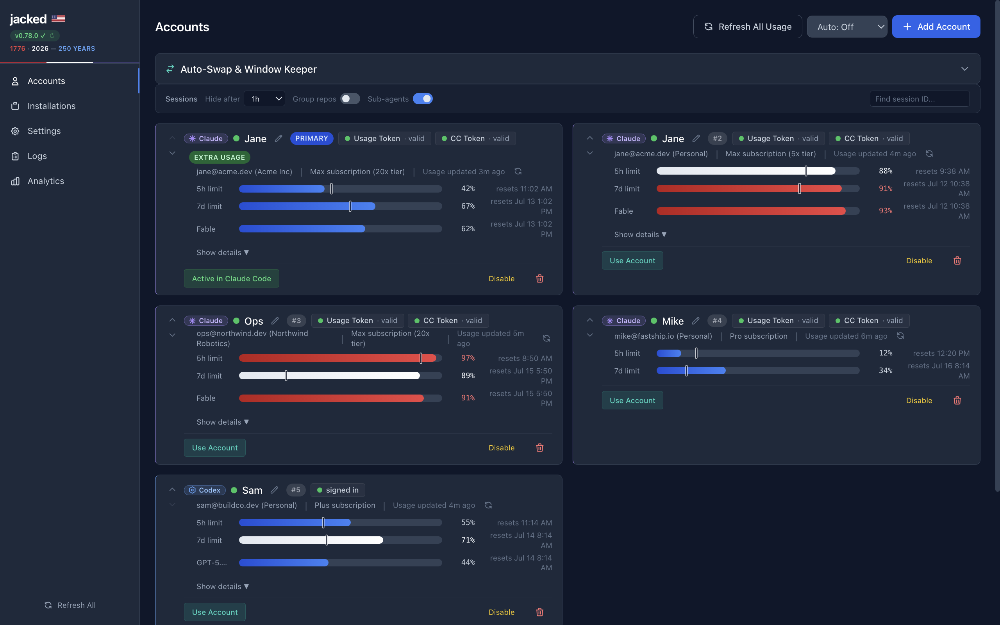
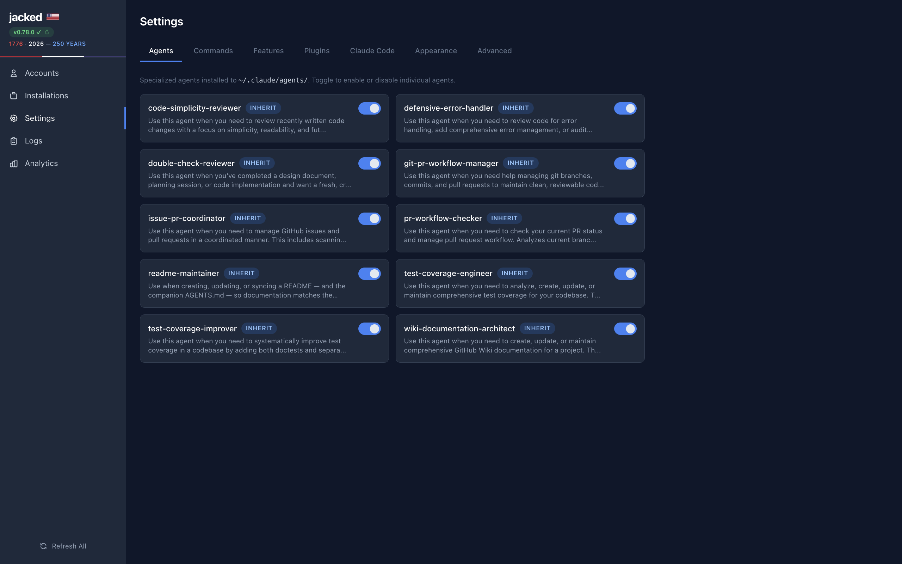
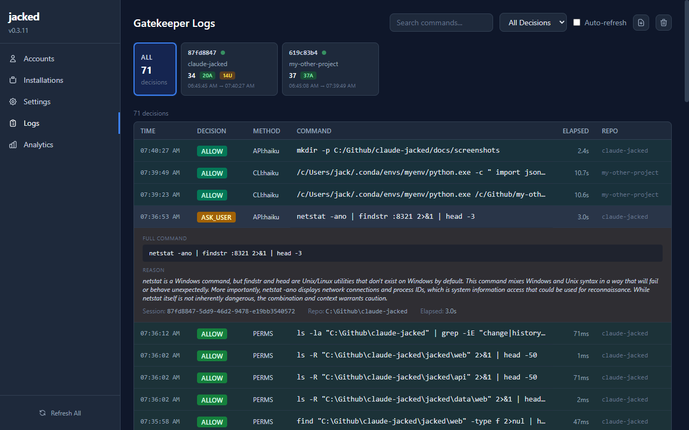
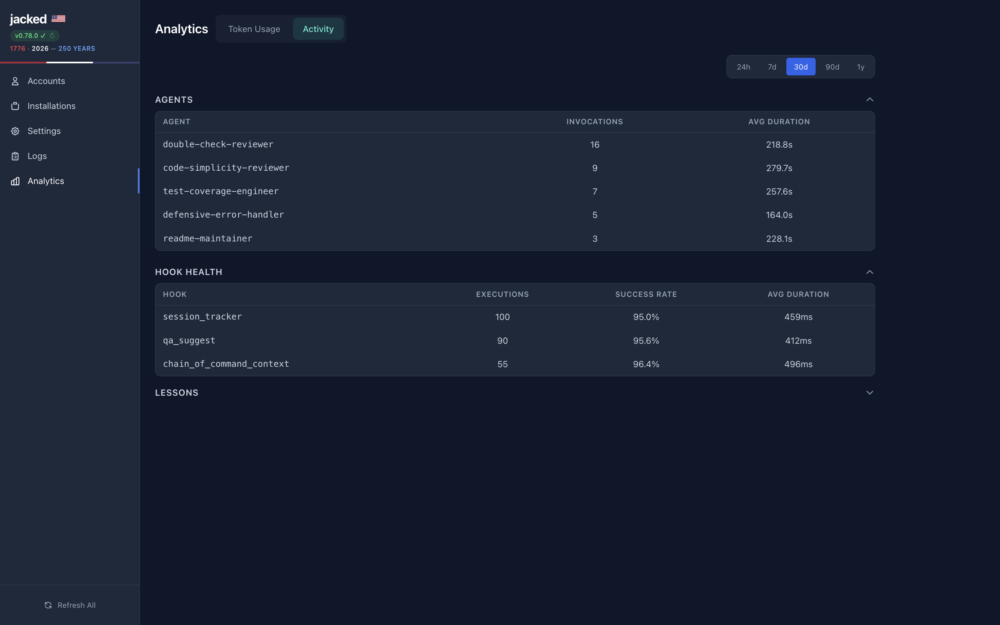
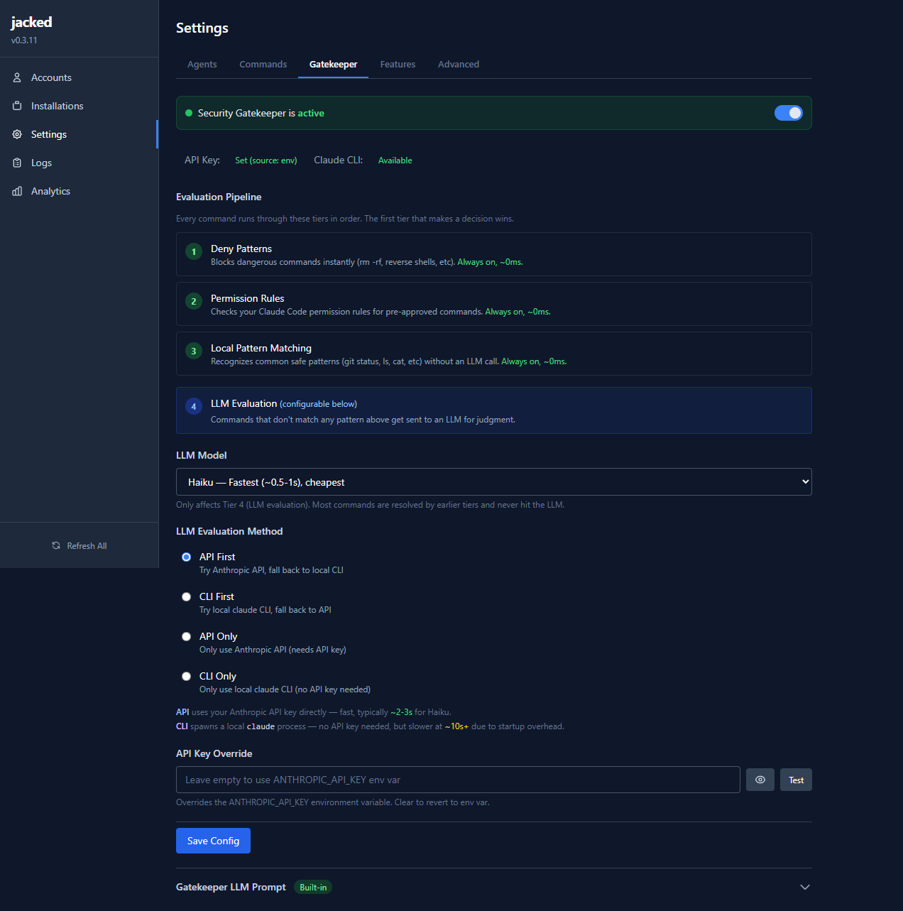
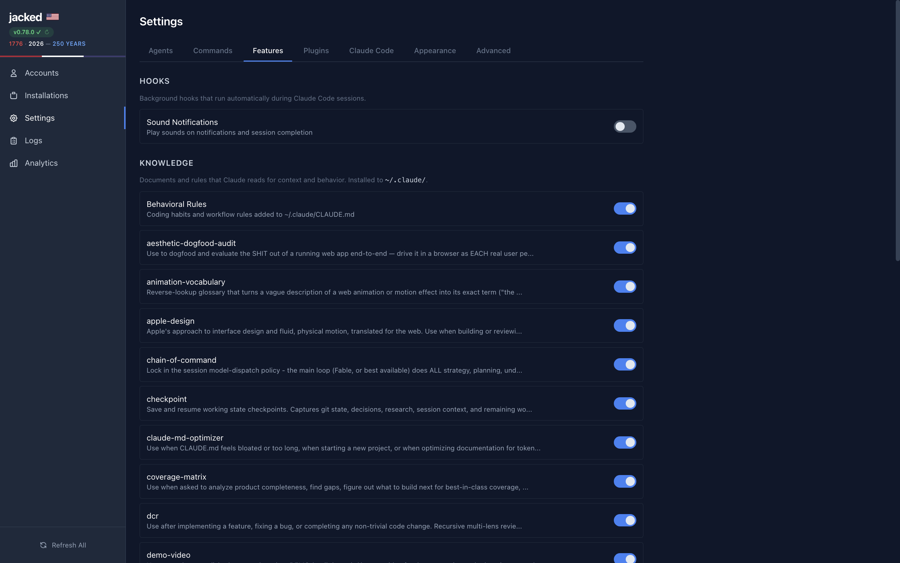
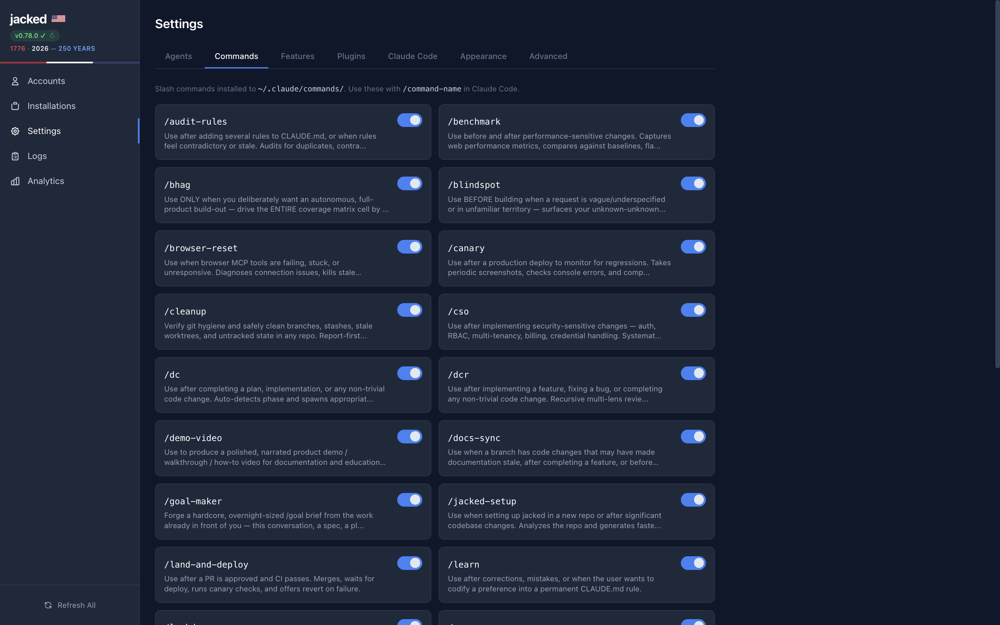

# claude-jacked

**Multi-account manager + skills suite for Claude Code (and Codex).** Juggle several Claude accounts with live usage tracking, automatic account switching, and a macOS menu-bar pill — plus a curated set of 30 slash commands and 10 review agents installed into Claude Code, all managed from a web dashboard.



---

## What You Get

- **Run multiple Claude accounts like one** — Add every account you own, watch each one's 5-hour and 7-day usage live, and let auto-swap rotate to a fresh account before you hit a limit. Works for Codex accounts too. The macOS menu-bar pill shows your active account's usage at a glance, with a dropdown for the whole fleet.
- **A curated skills suite, one command to install** — `jacked install` puts 30 battle-tested slash commands, 10 review agents, and behavioral rules into Claude Code (`/dcr` recursive multi-lens review, `/qa`/`/ux` browser testing, `/release`, `/whats-next` roadmap advisor, `/lockdown` supply-chain audit, and more). Upgrades diff cleanly — added/changed/removed, never touching your own files.
- **Manage everything from a web dashboard** — Accounts, usage analytics, feature toggles, swap history, logs — all from your browser. No config files, no terminal commands.
- **Legacy extras, off by default** — An LLM security gatekeeper (largely superseded by Claude Code's native auto permission mode; enable from Settings > Gatekeeper if you still want a second layer) and cross-machine semantic session search (*requires the [search] extra + Qdrant*).

---

## Quick Start

### Option 1: Let Claude Install It

Paste this into Claude Code and it handles everything:

```
Install claude-jacked for me. Use AskUserQuestion to ask me which features I want:

1. First check if uv and jacked are already installed (if uv is missing: curl -LsSf https://astral.sh/uv/install.sh | sh)
2. Ask me which install tier I want:
   - BASE (Recommended): Smart reviewers, commands, behavioral rules, web dashboard
   - SEARCH: Everything above + search past Claude sessions across machines (requires Qdrant Cloud)
   - SECURITY: Everything above + the LLM security gatekeeper enabled (installed by every tier, but disabled by default — this tier turns it on)
   - ALL: Everything
3. Install based on my choice:
   - BASE: uv tool install claude-jacked && jacked install --force
   - SEARCH: uv tool install "claude-jacked[search]" && jacked install --force
   - SECURITY: uv tool install claude-jacked && jacked install --force  (then enable the gatekeeper from the dashboard: Settings > Gatekeeper)
   - ALL: uv tool install "claude-jacked[all]" && jacked install --force  (then enable the gatekeeper from the dashboard)
4. If I chose SEARCH or ALL, help me set up Qdrant Cloud credentials
5. Verify with: jacked --help
6. Launch the dashboard: jacked webux
```

### Option 2: Manual Install

Run once from anywhere — installs globally to `~/.claude/` and applies to all your Claude Code sessions:

```bash
uv tool install claude-jacked   # tray icon + background service included by default
jacked install --force          # deploys skills/commands/agents/hooks AND starts the tray
jacked webux                    # opens your dashboard at localhost:8321
```

> **The tray is on by default.** A bare `uv tool install claude-jacked` now ships the tray (no `[tray]` extra needed), and `jacked install` registers login-autostart and starts it. Don't want the icon (or on a headless box)? `jacked install --force --no-tray`. **You MUST run `jacked install`** — `uv tool`/`pip install` only drop the package on disk; running `jacked` before that prints a loud banner reminding you.

> **Don't have uv?** Install it first: `curl -LsSf https://astral.sh/uv/install.sh | sh` (Mac/Linux) or `powershell -c "irm https://astral.sh/uv/install.ps1 | iex"` (Windows)

### Option 3: Install as a Plugin (Teams)

Add to your team's Claude Code environment — no Python install needed:

```bash
/plugin marketplace add jackneil/claude-jacked
/plugin install jacked@jacked-marketplace
```

Commands are namespaced as `/jacked:dcr`, `/jacked:qa`, etc. Includes all 30 commands and 10 agents. Does not include the Python-powered features (dashboard, gatekeeper, session search) — use Option 1 or 2 for those.

**Want more?** Add optional extras:

```bash
# Add session search (needs Qdrant Cloud ~$30/mo)
uv tool install "claude-jacked[search]" --force && jacked install --force

# Security gatekeeper hook is installed by default but starts disabled —
# enable it from the dashboard (Settings > Gatekeeper) when you want LLM-evaluated
# interception layered on top of Claude Code's auto permission mode.

# The background service + system tray icon ship by DEFAULT (auto-start on login) —
# `jacked install` already started them. Opt out of the icon: jacked install --force --no-tray
# (The legacy `claude-jacked[tray]` extra still resolves — it's just empty now.)

# Everything (base + search + tray)
uv tool install "claude-jacked[all]" --force && jacked install --force
```

---

## Your Dashboard

The web dashboard ships with every install. Run `jacked webux` to open it.

### Toggle Features On and Off

Enable or disable any of the 10 built-in code reviewers and 30 slash commands with one click. Each card shows what it does so you know what you're turning on.



### Monitor Security Decisions

Every tool call the gatekeeper evaluates is logged — bash commands, file operations, web access, and more. See the decision, the method used, the full command, and the LLM's reasoning — all filterable by session and method. Approve commands directly from the log viewer with "Always Allow."



### Track Everything

Approval rates, which evaluation methods are being used, command frequency, and system health — all at a glance.



<details>
<summary><strong>More Dashboard Views</strong></summary>

**Security Gatekeeper Configuration** — Configure the multi-tier evaluation pipeline, toggle per-tool interception, choose the LLM model, set the evaluation method, manage API keys, and edit the LLM prompt — all from the Gatekeeper tab.



**Feature Toggles** — Toggle hooks (session indexing, sound notifications) and knowledge documents (behavioral rules, skills, reference docs) on and off.



**Commands** — Enable or disable any of the 30 slash commands.



**Permissions Panel** — Manage allowed commands with project-level vs global scope. Add new allow rules or promote commands from the log viewer with "Always Allow."

**Security Profiles** — Export, import, and backup your gatekeeper configuration. Share security settings across machines or teams.

**Analytics Dashboard** — Charts, heatmap, command frequency breakdown, and drill-down by session or method.

</details>

---

## Table of Contents

- [What's Included](#whats-included)
- [Web Dashboard](#web-dashboard)
- [Background Service and Tray Icon](#background-service-and-tray-icon)
- [Upgrading](#upgrading)
- [Security Gatekeeper](#security-gatekeeper)
- [Session Search](#session-search)
- [Built-in Reviewers and Commands](#built-in-reviewers-and-commands)
- [Sound Notifications](#sound-notifications)
- [Uninstall / Troubleshooting](#uninstall--troubleshooting)
- [Cloud Database Setup (Qdrant)](#cloud-database-setup-qdrant)
- [Version History](#version-history)
- [Advanced / Technical Reference](#advanced--technical-reference)

---

## What's Included

### Base (`uv tool install claude-jacked`)

| Feature | What It Does |
|---------|--------------|
| **10 Code Reviewers** | Automatic checks for bugs, security issues, complexity, missing tests |
| **30 Slash Commands** | `/dc`, `/dcr`, `/docs-sync`, `/pr`, `/learn`, `/redo`, `/retry`, `/techdebt`, `/audit-rules`, `/cleanup`, `/qa`, `/qa-video`, `/demo-video`, `/ux`, `/swarm`, `/swarm-research`, `/release`, `/whats-next`, `/goal-maker`, `/bhag`, `/jacked-setup`, `/freeze`, `/unfreeze`, `/cso`, `/lockdown`, `/retro`, `/canary`, `/benchmark`, `/land-and-deploy`, `/browser-reset` |
| **Behavioral Rules** | Smart defaults that make Claude follow better workflows |
| **Sound Notifications** | Audio alerts when Claude needs input or finishes (via `--sounds`) |
| **Web Dashboard** | 5-page local dashboard — manage everything from your browser |
| **Account Management** | Track Claude accounts, usage limits, subscription status |
| **Feature Toggles** | Enable/disable any reviewer, command, or hook from the dashboard |
| **Analytics** | Approval rates, command usage, charts, heatmap, drill-down |
| **Security Profiles** | Export, import, and backup gatekeeper configurations |
| **Permissions Management** | "Always Allow" from logs, project-level vs global permission scopes |

### Search Extra (`uv tool install "claude-jacked[search]"`)

| Feature | What It Does |
|---------|--------------|
| **Session Search** | Find any past Claude conversation by describing what you were working on |
| **Cross-Machine Sync** | Start on desktop, continue on laptop — your history follows you |
| **Team Sharing** | Search your teammates' sessions (with their permission) |

### Security Gatekeeper (installed disabled — enable from Settings > Gatekeeper)

| Feature | What It Does |
|---------|--------------|
| **Security Gatekeeper** | Intercepts all tool calls — auto-approves safe ones, blocks dangerous ones, asks about the rest |
| **Tool Registry** | Per-tool enable/disable toggles from the dashboard (Bash, Read, Edit, Write, Grep, Glob, Web, MCP) |
| **Shell Injection Defense** | Detects shell operators (`&&`, `|`, `;`, `>`, `` ` ``, `$()`) to prevent chaining attacks |
| **Path Safety** | Blocks access to sensitive files (`.env`, `.ssh/`, credentials) across all file tools |
| **Freeze Boundary** | `/freeze <path>` restricts Edit/Write operations to one directory — prevents accidental scope creep during focused work |
| **File Context Analysis** | Reads referenced scripts and evaluates what code actually does |
| **Command Categories** | Configurable per-category behavior (allow/ask/evaluate) for network, packages, git, docker, etc. |
| **Customizable Prompt** | Tune the safety evaluation via the dashboard or `~/.claude/gatekeeper-prompt.txt` |
| **Permission Audit** | Scans your permission rules for dangerous wildcards that bypass the gatekeeper |
| **Session-Tagged Logs** | Every decision tagged with session ID for multi-session tracking |
| **Log Redaction** | Passwords, API keys, and tokens automatically redacted from logs |

---

## Web Dashboard

```bash
jacked webux                    # Opens dashboard at localhost:8321
jacked webux --port 9000        # Custom port
jacked webux --no-browser       # Start server without opening browser
```

The dashboard is a local web app that runs on your machine. All data stays in `~/.claude/jacked.db` — nothing is sent anywhere.

**5 pages:** Accounts, Installations, Settings (tabbed: Agents / Commands / Gatekeeper / Features / Plugins / Claude Code / Advanced / Profiles), Logs, Analytics.

---

## Background Service and Tray Icon

Here's the deal: if you don't want to remember to run `jacked webux` every time, run it as a background service instead. You get a purple "J" in the macOS menu bar (or Windows system tray) that stays out of your way until you need it.

### Install

```bash
uv tool install claude-jacked --force   # pystray + Pillow ship in the base package
jacked install --force                  # wires up hooks AND starts the tray (autostart on login)
```

`jacked install` already registers login-autostart and starts the tray — no separate `jacked service install/start` needed. `pystray` and `Pillow` are core dependencies now, so the icon "just works" out of the base package. Don't want it? `jacked install --force --no-tray`.

### What You Get

- **Purple "J" in your menu bar / system tray** — always-on dashboard, one click away.
- **Right-click menu:** Open Dashboard, Restart, Stop, Start on Login toggle, current version label (e.g. `v0.41.2 -> v0.42.0 (update)` when outdated), and **Check for updates...** to force a fresh PyPI poll on demand.
- **Auto-start on login** — `jacked service install` writes a macOS launchd plist (`~/Library/LaunchAgents/ai.hank.jacked.plist`) or a Windows startup VBS script. Service runs on reboot too.
- **Crash recovery, not nag-ware** — KeepAlive is scoped to `SuccessfulExit=false`, so a clean stop from the tray or CLI *won't* trigger a respawn. Only actual crashes come back.
- **One-click upgrades** — when a newer version hits PyPI, the version item flips to a clickable `v{current} -> v{latest} (update)`. Click it and jacked runs the full upgrade sequence (`uv tool install --force` + `jacked install --force` + service restart) in a detached helper that survives its own binary being replaced mid-update.
- **CLI equivalent** — `jacked upgrade` does the same three-step upgrade from the terminal. No more remembering to run `uv tool install`, then `jacked install`, then restart the service separately.
- **Recovery file** — if the auto-update fails, `~/.claude/jacked-update-failed.txt` explains what happened and how to recover manually. The tray warns you on the next startup so you don't miss it.

### Commands

```bash
jacked service install     # configure auto-start on login (launchd / Startup folder)
jacked service uninstall   # remove auto-start config
jacked service start       # start the service with tray icon (foreground — blocks)
jacked service stop        # stop the running service
jacked service restart     # stop + detached start (returns immediately)
jacked service restart --foreground   # same but runs in foreground like service start
jacked service status      # show PID, port, uptime, autostart state
```

### Troubleshooting

If the tray icon disappears, won't come back, or claims the port is in use, work through these in order:

```bash
# 1. What's holding port 8321?
lsof -i :8321 -sTCP:LISTEN            # macOS / Linux
netstat -ano | findstr :8321          # Windows

# 2. On macOS, stop launchd's KeepAlive loop so it doesn't fight you:
launchctl unload ~/Library/LaunchAgents/ai.hank.jacked.plist

# 3. Kill whatever's on the port (use the PID from step 1):
kill -9 <PID>                         # POSIX
taskkill /PID <PID> /F                # Windows

# 4. Clear stale PID file:
rm -f ~/.claude/jacked-service.pid    # POSIX
del %USERPROFILE%\.claude\jacked-service.pid   # Windows

# 5. Wait a couple seconds, then confirm the port is free:
lsof -i :8321 -sTCP:LISTEN   # should print nothing

# 6. Start fresh:
jacked service start
```

Common issues:

- **Tray icon never appears after install** — the tray ships by default now, so the usual causes are: (a) you passed `jacked install --no-tray`, (b) you're on a **headless** box (no `DISPLAY`/Wayland) where the icon is skipped on purpose — the service still runs, reach it at `http://127.0.0.1:8321`, or (c) the service isn't running: `jacked service start`. Confirm with `curl -s http://127.0.0.1:8321/api/version`.
- **Tray shows a wrong version** — the menu anchors on the running process's `__version__`, so if it shows "v0.41.2" and you just upgraded, the running process is stale. The tray is still the *old* binary. Fix: `jacked service stop && jacked service start`, or `jacked service restart`. `Check for updates...` in the menu forces a fresh PyPI poll (useful if only the cached "latest" is stale).
- **`jacked upgrade` said "Upgrade complete" but the tray is still running the old version** — this was the 0.41.6→0.41.9 bug. `jacked service stop` sends SIGTERM, but pystray on macOS runs the AppKit NSRunLoop on the main thread, which can silently swallow Python signals. The upgrade's port-wait timed out and the detached `service start` hit "port in use." Fixed in 0.41.10+: graceful stop now polls for actual PID death and escalates to SIGKILL if SIGTERM is ignored. Confirm the fix took with `curl -s http://127.0.0.1:8321/api/version` and check the `current` field matches your installed version. If you're stuck on an older upgrade, follow the port-recovery sequence above and then `jacked service start`.
- **"Port 8321 in use" after `jacked upgrade`** — an old tray didn't fully release the socket. Resolved in 0.41.6+ for service restart, and in 0.41.10+ for the upgrade path specifically (with SIGKILL escalation). Run `jacked upgrade` once more to pick up the fix.
- **Auto-update ran but tray never came back** — the updater's detached `service start` hit the port race. Fixed in 0.41.4+ and hardened again in 0.41.13 (force-kills stuck parent + port squatter, verifies new service actually binds). If you're still stuck, follow the cleanup steps above, then run `jacked service start`.
- **Claude Code keeps asking me to log in** — jacked was rotating the active account's CC refresh token out from under Claude Code. Fixed in 0.41.2+. Update and the issue goes away. Architecture doc at `docs/architecture/oauth-and-credential-flows.md` §7.1-7.3 explains the full mechanism.
- **Auto-update failed** — read `~/.claude/jacked-update-failed.txt` and the log at `~/.claude/jacked-update.log`. The recovery file lists the exact commands to finish the upgrade manually.

Verify what's actually running:

```bash
# What version is the live tray reporting?
curl -s http://127.0.0.1:8321/api/version
# {"current":"0.41.10","latest":"0.41.10","outdated":false,...}

# Which PID owns the port, and when did it start?
lsof -iTCP:8321 -sTCP:LISTEN                   # macOS / Linux
ps -p <PID> -o pid,lstart,command               # when did it launch?
```

If `current` is older than the version your `uv tool list` shows, the running tray predates the install — stop + start it.

### Installing from scratch

We use `uv` for installation — it's a standalone tool from Astral that installs and manages Python CLI apps in isolated venvs. Much faster than pip, handles Python interpreter management, and keeps `claude-jacked` from conflicting with anything else on your system. Follow the steps for your OS.

---

#### macOS

```bash
# 1. Install uv (skip if you already have it)
curl -LsSf https://astral.sh/uv/install.sh | sh

# 2. Reload your shell so `uv` is on PATH. Either restart your terminal or:
source ~/.zshrc   # or ~/.bashrc

# 3. Verify
uv --version

# 4. Install jacked (tray icon ships by default)
uv tool install claude-jacked

# 5. Wire up Claude Code hooks + the launchd auto-start + tray
jacked install
jacked service install
```

Notes:
- uv's installer adds `~/.local/bin` to your shell rc automatically. If `jacked --version` says "command not found" after step 5, run `uv tool update-shell && source ~/.zshrc` or open a fresh terminal.
- Auto-start plist goes to `~/Library/LaunchAgents/ai.hank.jacked.plist`. Removes cleanly via `jacked service uninstall`.

---

#### Linux

```bash
# 1. Install uv
curl -LsSf https://astral.sh/uv/install.sh | sh

# 2. Reload shell
source ~/.bashrc   # or ~/.zshrc / ~/.profile

# 3. Verify
uv --version

# 4. Install jacked (tray icon ships by default)
uv tool install claude-jacked

# 5. Wire up Claude Code hooks + start the tray
jacked install
jacked service start
```

Notes:
- Requires a system tray provider (most desktop environments ship one — GNOME may need the AppIndicator extension; KDE/Cinnamon/XFCE work out of the box). On distros without tray support, uvicorn still runs headless and the dashboard is reachable at `http://localhost:8321` — check `~/.claude/jacked-service.log`.
- `jacked service install` isn't wired for Linux yet — for boot-time auto-start, add `jacked service start` to your DE's Startup Applications, or drop a systemd user unit yourself (see issue tracker).

---

#### Windows

```powershell
# 1. Install uv (standalone installer, no Python prerequisite)
powershell -c "irm https://astral.sh/uv/install.ps1 | iex"

# 2. Close and reopen your terminal so `uv` is on PATH.
#    The installer added %USERPROFILE%\.local\bin to User PATH.

# 3. Verify
uv --version

# 4. Install jacked (tray icon ships by default)
uv tool install claude-jacked

# 5. Wire up Claude Code hooks + Startup-folder auto-start + tray
jacked install
jacked service install
```

Notes:
- After step 4, `jacked.exe` lives at `%USERPROFILE%\.local\bin\jacked.exe`. uv's installer adds that dir to PATH — if `jacked --version` fails, open a new terminal (PATH changes don't propagate into open ones).
- `jacked service install` writes a `.vbs` launcher into `shell:startup` (`%APPDATA%\Microsoft\Windows\Start Menu\Programs\Startup\jacked.vbs`). It re-runs on login. Remove via `jacked service uninstall`.
- **PowerShell execution policy warning**: if `irm | iex` is blocked, run `Set-ExecutionPolicy -Scope CurrentUser RemoteSigned` first, or download and run the installer script manually from [astral.sh/uv/install.ps1](https://astral.sh/uv/install.ps1).
- If the tray icon doesn't appear, the service is still running headless — check `%USERPROFILE%\.claude\jacked-service.log` and hit `http://127.0.0.1:8321` in your browser.

---

#### After install (all platforms)

Dashboard is at `http://localhost:8321`. The tray icon's right-click menu has Open Dashboard, Restart, Stop, Start on Login, version + "Check for updates...", and the clickable "Update to vX.Y.Z ->" item when a newer version hits PyPI.

Upgrading later is one command: `jacked upgrade` (from the terminal) or click the Update line in the tray menu. Both auto-detect that you installed via uv and re-use it. Don't have uv anymore? Reinstall it first: same curl/powershell commands as step 1.

Extras:
- `uv tool install "claude-jacked[search]" --force` — adds Qdrant-backed semantic session search (requires Qdrant Cloud).
- `uv tool install "claude-jacked[all]" --force` — tray + search together.
- The security gatekeeper hook is installed by default but starts **disabled** — Claude Code's auto permission mode handles approvals natively. Turn the gatekeeper on from the dashboard (Settings > Gatekeeper) when you want LLM-evaluated interception layered on top.

Requirements: Python 3.10+ (uv will fetch one for you if your system doesn't have a compatible version — you don't need to install Python separately).

---

## Upgrading

```bash
jacked upgrade
```

That's it. One command. Works on macOS, Linux, and Windows. Does all three things `uv tool install --force` alone doesn't do:

1. `uv tool install "claude-jacked[tray]" --force` — new package on disk
2. `jacked install --force` — migrate `settings.json` hooks to the shim form (`jacked _hook <name>`) so they survive Python version bumps
3. `jacked service restart` — reload the running service with the new code (only if a service is running)

**Why you need all three:** `uv tool install --force` just drops the new package on disk. The service you already have running is still executing the old version in memory, and your `settings.json` may still have hook paths that point at the old site-packages location (broken if `uv` upgraded Python under you).

### Options

- `jacked upgrade --extras search` — upgrade with the `[search]` extra instead of `[tray]` (Qdrant session search)
- `jacked upgrade --extras all` — everything
- `jacked upgrade --skip-service` — just swap the package and migrate settings, don't restart the running service

### Cross-platform notes

- **macOS/Linux:** runs inline. Your terminal shows live output from each step.
- **Windows:** spawns a detached `cmd.exe` helper and exits immediately. Windows can't overwrite a running `.exe`, so this process has to step out of the way before `uv tool install` replaces `jacked.exe`. The helper waits for this process to exit, then runs the three steps with output appended to `~/.claude/jacked-update.log`. You can `type %USERPROFILE%\.claude\jacked-update.log` to follow along.

### Tray upgrades

If you're running the background service, you can also click **Update to vX.Y.Z ->** in the tray menu when a newer version is available on PyPI. Same three-step sequence, fully detached — survives its own binary being replaced mid-update.

### What changed in this update

`jacked install` and `jacked upgrade` print a concise change-summary instead of a static banner: the version **before → after**, plus exactly which skills, commands, agents, lenses, and templates were **added / changed / removed** (and a count of everything unchanged). It's backed by a manifest (`~/.claude/jacked-manifest.json`) recording what jacked installed, so an upgrade can also prune artifacts it no longer ships — without ever touching your own files. The same summary shows up in the dashboard as a one-shot panel after an upgrade. Run `jacked install --json` for the machine-readable diff.

---

## Security Gatekeeper

> **Disabled by default.** Claude Code's auto permission mode now handles approvals natively, so the gatekeeper installs but starts off. Turn it on from the dashboard at **Settings > Gatekeeper** when you want LLM-evaluated interception layered on top of auto mode (or set `gatekeeper.enabled` to `true` in the SQLite settings table). Everything described below applies once you've enabled it.

When enabled, the security gatekeeper intercepts **all tool calls** Claude makes — bash commands, file reads/writes, web access, and MCP tools — and decides whether to auto-approve, block, or ask you. Each tool type gets the appropriate level of scrutiny. Most decisions resolve in under 2 milliseconds.

### How It Works

The hook uses an empty matcher to intercept every tool call, then dispatches by tool type:

- **Bash commands** go through the full multi-tier evaluation chain (see below)
- **File tools** (Read, Edit, Write, Grep, Glob) get path-safety checks for sensitive files and directories
- **Web tools** (WebFetch, WebSearch) are auto-approved with audit logging (read-only access)
- **MCP tools** are auto-approved with audit logging (user opted in via toggle)

Each tool can be individually enabled or disabled from the dashboard via the **tool registry** (Settings > Gatekeeper > Tools).

#### Bash Evaluation Chain

A multi-tier chain, fastest first:

| Tier | Speed | What It Does |
|------|-------|--------------|
| **Deny patterns** | <1ms | Blocks dangerous commands with labeled reasons (sudo, rm -rf, reverse shells, DROP, etc.) |
| **Command categories** | <1ms | Configurable per-category behavior — allow, ask, or evaluate (network, packages, git, docker, etc.) |
| **Path safety** | <1ms | Blocks bash commands targeting sensitive files (`.env`, `.ssh/`, credentials, keystores) |
| **Permission rules** | <1ms | Checks commands already approved in your Claude settings |
| **Local allowlist** | <1ms | Matches safe patterns (specific git/gh/docker/make subcommands, pytest, etc.) |
| **LLM evaluation** | ~2s | Sends ambiguous commands to an LLM with file context for judgment |

Commands containing shell operators (`&&`, `||`, `;`, `|`, etc.) always go to the LLM — they're never auto-approved by the local allowlist.

#### Always Allow

Approve commands directly from the **Logs** page. Click "Always Allow" on any logged command to add it to your permission rules. Permissions can be scoped to the current project or applied globally.

### Install / Uninstall

The gatekeeper hook ships with every install (`jacked install --force`) but starts **disabled** — enable it from the dashboard (Settings > Gatekeeper). To install without the hook at all, pass `--no-security`:

```bash
jacked install --force                # gatekeeper hook installed, disabled by default
jacked install --force --no-security  # skip the gatekeeper hook entirely
```

To remove just the security hook after the fact:
```bash
jacked uninstall --security
```

### Configuration

Configure the gatekeeper from the **dashboard** (Settings > Gatekeeper tab) or the CLI:

- **LLM model:** Haiku (fastest, cheapest), Sonnet, or Opus
- **Evaluation method:** API First, CLI First, API Only, or CLI Only
- **Custom prompt:** Edit the LLM evaluation prompt from the dashboard or via `jacked gatekeeper show`

### Faster LLM Evaluation

With an Anthropic API key, the gatekeeper calls the API directly (~2s) instead of spawning a CLI process (~8s):

```bash
export ANTHROPIC_API_KEY="sk-..."
```

Or set the API key in the dashboard under Settings > Gatekeeper > API Key Override.

### Debug Logging

Every decision is logged to `~/.claude/hooks-debug.log`, tagged with session IDs:

```
2025-02-07T11:36:34 [87fd8847] EVALUATING: ls -la /tmp
2025-02-07T11:36:34 [87fd8847] LOCAL SAID: YES (0.001s)
2025-02-07T11:36:34 [87fd8847] DECISION: ALLOW (0.001s)
```

Or view decisions in the dashboard under **Logs** — filterable, searchable, exportable.

### Permission Audit

If you've set broad permission wildcards in Claude Code (like `Bash(python:*)`), those commands bypass the gatekeeper entirely. The audit catches this:

```bash
jacked gatekeeper audit           # Scan permission rules
jacked gatekeeper audit --log     # Also review recent auto-approved commands
```

Sensitive data (passwords, API keys, tokens) is automatically redacted from all logs.

---

## Session Search

Once installed with the `[search]` extra, search your past Claude sessions from within Claude Code.

### Finding Past Work

```
/jacked user authentication login
```

```
Search Results:
#  Score  User  Age      Repo           Preview
1  92%    YOU   3d ago   my-app         Implementing JWT auth with refresh tokens...
2  85%    YOU   2w ago   api-server     Adding password reset flow...
3  78%    @sam  1w ago   shared-lib     OAuth2 integration with Google...
```

### Resuming Work from Another Computer

```
/jacked that shopping cart feature I was building
```

Claude finds it and you can continue right where you left off.

### Team Sharing

Share knowledge across your team by using the same cloud database:

```bash
# Everyone uses the same database
export QDRANT_CLAUDE_SESSIONS_ENDPOINT="https://team-cluster.qdrant.io"
export QDRANT_CLAUDE_SESSIONS_API_KEY="team-api-key"

# Each person sets their own name
export JACKED_USER_NAME="sarah"
```

```
/jacked how did Sam implement the payment system
```

### `/recover` — rebuild a crashed session

Opened Claude in a folder whose last session crashed mid-work and you don't know the
session ID? Run `/recover`. It finds the most-recently-active prior session for the
current folder from its on-disk transcript, shows you the pick to confirm, then injects
a budgeted working-state digest (last instruction, todos, recent actions, files touched)
so you continue right where it died — and prints `claude --resume <id>` for a full native
continuation. Works on a bare install; no Qdrant/search extra required.

It recommends the newest session **with real substance** — a near-empty newest session is skipped (but still offered as an alternate). And if the crashed session was actively driving a `/goal` or `/loop` (which can't be auto-resumed), the digest surfaces that exact command verbatim so you can copy-paste it back into Claude Code to restart it.

### `/whats-next` ambition: safe by default, `/bhag` to build it all

`/whats-next` is the everyday, **safe-by-default** roadmap command: it picks the highest-leverage work and forges a `/goal` brief that lands on a feature branch and **opens a PR for review — it never merges to `main` itself**.

When a product is **pre-production** and you want it driven to completion autonomously, run **`/bhag`** (Big Hairy Audacious Goal). It runs the coverage matrix at full breadth and forges a long-running `/goal` brief that loops cell-by-cell — implement → verify → PR → **merge to `main`** → next — until the product is built out. Auto-merge is **double-gated**: it only happens when the repo's declared Lifecycle is Greenfield/Alpha **and** you explicitly authorize it in-session (and only after CI is green); on anything resembling a live product it refuses and degrades to safe staged PRs. `/bhag` is a deliberately-typed command (never auto-triggered), because auto-merging to `main` in a loop is the most powerful thing jacked can do.

**Already know what to build?** Run **`/goal-maker`** — it skips the deciding and packages the work already in front of you (this conversation, a spec, a plan, an in-flight build) into one hardcore, **overnight-sized** `/goal` brief: full scope, TDD + tests-green, UI/UX + front-end-polish gates, evidence-based DONE, and a `Next:` line so a later `/whats-next` picks up. It **defaults to opening a PR**; pass `merge` (`/goal-maker merge`) to auto-merge each milestone — always gated on green CI, never a red build, and with the `gh pr checks` output pasted so the run is verifiable. Like `/bhag` it's deliberately typed (never auto-triggered) so auto-merge can't be reached by accident. The trio: **`/whats-next` decides**, **`/goal-maker` packages what you've decided**, **`/bhag` drives the whole matrix autonomously**.

---

## Built-in Reviewers and Commands

### Quick Commands

Type these directly in Claude Code:

| Command | What It Does |
|---------|--------------|
| `/dc` | **Double-check** — Reviews your recent work for bugs, security issues, and problems |
| `/dcr` | **Recursive Review** — Spawns parallel reviewers across 11 lenses (security, performance, logic, UX, observability, data integrity, etc.) in waves until all pass clean |
| `/swarm` | **Swarm** — Parallel implementation across 3-8 coordinated agents with file-level isolation |
| `/swarm-research` | **Divergent Research** — Spawns 2-5 independent agents from different angles, synthesizes proposals, then verifies + attacks with devil's advocate |
| `/qa` | **QA Testing** — Browser-based QA testing of UI changes with Playwright or Chrome DevTools MCP |
| `/ux` | **UX Testing** — Parallel browser-based UX checks across multiple pages and aspects simultaneously |
| `/qa-video` | **QA Video** — Records a playable video of a test journey (true-motion via Playwright MCP video + chapters, or a frame-stitched MP4/GIF) plus a video-synced narration doc — for regression evidence and bug repros |
| `/demo-video` | **Demo Video** — Produces a polished, narrated feature walkthrough video for docs/education from a committed narration script (Playwright recording + timed `say`/TTS voiceover + captions, muxed with ffmpeg) — regenerable when the UI changes |
| `/whats-next` | **Roadmap Advisor** — Weighs a coverage-matrix read (toward 10/10) plus plans, issues, commits, lifecycle, and (when configured) assigned Asana tasks, then **decides the single highest-leverage initiative** and forges a ready-to-run `/goal` brief (≤4000 chars) for autonomous, tested delivery |
| `/goal-maker` | **Goal Forge** — Packages the work already in front of you (this conversation, a spec, a plan, an in-flight build) into one overnight-sized `/goal` brief (≤4000 chars) — full scope, TDD, UI/UX + polish gates, evidence-based DONE, plan-ahead `Next:`. Defaults to PR; `merge` arg auto-merges each milestone on green CI |
| `/bhag` | **Big Hairy Audacious Goal** — Autonomous full-product build-out: drives the entire coverage matrix cell-by-cell and, on a pre-production repo you explicitly authorize, opens a PR and merges each verified improvement to `main` in a loop until built out. Deliberately typed, never auto-triggered; refuses auto-merge on any live-users repo |
| `/pr` | **Pull Request** — Checks PR status, creates/updates PRs with proper issue linking |
| `/release` | **Release** — Full release pipeline: bump version, push, CI, GitHub Release, PyPI publish |
| `/learn` | **Learn** — Distills a lesson from the current session into a CLAUDE.md rule |
| `/redo` | **Redo** — Scraps the current approach and re-implements cleanly with full hindsight |
| `/retry` | **Retry** — Recovers from a transient API/rate-limit error: figures out where the turn fell off and resumes only what's needed, without changing the task |
| `/techdebt` | **Tech Debt** — Scans for TODOs, oversized files, missing tests, dead code |
| `/audit-rules` | **Audit Rules** — Checks CLAUDE.md for duplicates, contradictions, stale rules |
| `/cleanup` | **Cleanup** — Verifies git hygiene and safely cleans branches, stashes, stale worktrees, and untracked state. Report-first, confirm-each, never loses work |
| `/jacked-setup` | **Repo Setup** — Generates repo-specific configs for `/whats-next`, `/qa`, `/ux`, `/dcr`, `/docs-sync` — faster repeat runs |
| `/freeze` | **Freeze** — Restricts file edits to a single directory, enforced by the security gatekeeper. Requires the gatekeeper to be **enabled** (Settings > Gatekeeper) — with it disabled (the default), the freeze file is written but not enforced |
| `/unfreeze` | **Unfreeze** — Removes the edit restriction set by `/freeze` |
| `/cso` | **Security Audit** — Systematic OWASP Top 10 + STRIDE threat model analysis with confidence-gated findings |
| `/retro` | **Retrospective** — Git history analysis for contributor metrics, test health, velocity trends |
| `/canary` | **Canary** — Post-deploy monitoring with baselines, console errors, performance checks |
| `/benchmark` | **Benchmark** — Performance regression detection via browser Performance API |
| `/land-and-deploy` | **Land & Deploy** — Merges PR, waits for CI/deploy, runs canary verification, offers revert |
| `/browser-reset` | **Browser Reset** — Diagnoses and fixes stuck browser MCP connections |
| `/docs-sync` | **Docs Sync** — Diffs branch against base, maps code changes to affected docs, spawns parallel update agents |
| `/lockdown` | **Supply-Chain Lockdown** — Audits repo against supply-chain attacks (lockfile integrity, CVE/malware scan, Actions SHA-pinning, provenance, secrets), HIPAA mapping for PHI repos. `fix` mode auto-hardens low-risk items; `baseline` installs ongoing CI monitoring |

### Smart Reviewers

These work automatically when Claude thinks they'd help, or you can ask for them:

| Reviewer | What It Catches |
|----------|-----------------|
| **Double-check** | Security holes, authentication gaps, data leaks |
| **Code Simplicity** | Over-complicated code, unnecessary abstractions |
| **Error Handler** | Missing error handling, potential crashes |
| **Test Coverage** | Untested code, missing edge cases |

**Example:** After building a new feature:
```
Use the double-check reviewer to review what we just built
```

### QA Browser Testing

The `/qa` command runs browser-based QA on UI changes from the current session. It detects modified UI files (JS, CSS, HTML, Vue, Svelte, etc.), opens the app in a browser, and runs visual checks, interactive tests, and console error scans. Auto-suggested via a Stop hook when UI files are modified. Requires Playwright MCP or Claude-in-Chrome.

### Asana in `/whats-next`

When Asana is reachable, `/whats-next` blends your assigned tasks into the same coverage-led recommendation as GitHub issues and code TODOs. Run `/jacked-setup whats-next` once per repo to probe for access (an Asana MCP plugin, a local `asana` CLI, or `ASANA_PERSONAL_ACCESS_TOKEN`) and write a `## Asana Integration` block into the standalone command. Tasks that touch the current repo — by GitHub URL, repo basename, file/module mention, or project-name resemblance — are weighed alongside the rest, with priority and due-date read as demand/cost-of-delay signals. Asana origin appears on the Evidence line; it grants no priority bonus, and if Asana isn't configured the step is skipped silently.

---

## Sound Notifications

Get audio alerts so you don't have to watch the terminal:

```bash
jacked install --force --sounds
```

- **Notification sound** — Plays when Claude needs your input
- **Completion sound** — Plays when Claude finishes a task

Works on Windows, Mac, and Linux. To remove: `jacked uninstall --sounds`

---

## Uninstall / Troubleshooting

### Uninstall

```bash
jacked uninstall && uv tool uninstall claude-jacked
```

Your cloud database stays intact — reinstall anytime without losing history.

### Common Issues

**"jacked: command not found"** — Run `uv tool update-shell` and restart your terminal.

**Search isn't working** — You need Qdrant Cloud set up first. Ask Claude: `Help me set up Qdrant Cloud for jacked`

**Sessions not showing up** — Run `jacked backfill` to index existing sessions.

**Windows errors** — Claude Code on Windows uses Git Bash, which can have path issues. Ask Claude: `Help me fix jacked path issues on Windows`

---

## Cloud Database Setup (Qdrant)

> **Only needed for the `[search]` extra.** The base install works without Qdrant.

1. Install the search extra: `uv tool install "claude-jacked[search]"`
2. Go to [cloud.qdrant.io](https://cloud.qdrant.io) and create an account
3. Create a cluster (paid tier ~$30/month required)
4. Copy your cluster URL and API key
5. Add to your shell profile:

```bash
export QDRANT_CLAUDE_SESSIONS_ENDPOINT="https://your-cluster.qdrant.io"
export QDRANT_CLAUDE_SESSIONS_API_KEY="your-api-key"
```

6. Restart terminal and run:
```bash
jacked backfill    # Index existing sessions
jacked status      # Verify connectivity
```

---

## Security Note

**Your conversations are sent to Qdrant Cloud** (if using [search]). This includes everything you and Claude discuss, code snippets, and file paths.

**Recommendations:** Don't paste passwords or API keys in Claude sessions. Keep your Qdrant API key private. For sensitive work, consider self-hosting Qdrant.

---

## Version History

| Version | Changes |
|---------|---------|
| **0.69.1** | **`fix(menubar)`: event-driven tray freshness — the pill and `/panel` dropdown update within ~1s of a dashboard usage refresh or account switch.** Two staleness bugs stacked: the pill only re-polled every 30s, and the dropdown/side-panel WKWebViews suspend their JS timers while offscreen, freezing the panel's own 15s reload the moment it closed. Now a stdlib-only in-process change counter (`jacked/usage_events.py`) is bumped by every usage-cache write, Claude credential switch, and Codex swap; the mac agent watches it on a 1s timer (an int compare — no HTTP/DB) and on change refreshes the pill and nudges both `/panel` webviews via `evaluateJavaScript` (which runs even while detached). Webviews also reload on popover/panel show and on `visibilitychange`, with a load-sequence guard so a slow stale response can't overwrite a fresher render. The 30s poll remains as the heartbeat for cross-process writers (a separately-run `webux`). |
| **0.69.0** | **`/release` ships the way each repo actually ships — no longer hardcoded to claude-jacked/PyPI.** The engine was baked to one pipeline (version in `jacked/__init__.py`, gate `uv build`+`twine`+`pytest`, publish via GitHub-Release→PyPI, push `master`) — so on any other repo it read a nonexistent version and ran the wrong publish. Now it **detects the shipping model** (`pypi` / `npm` / `npm-changesets` / `calver` / `cargo` / `go-module-tag` / `pr-to-main-deploy` / `github-release-only`) from the manifests + what CI actually does, reads/bumps the **real** version source (or none, for CalVer / deploy-on-merge repos), gates on the repo's **own** build+test, then publishes/deploys the right way and verifies it landed (index-installable, or the deploy is green **and** the app URL is actually up). Critically it recognizes **PR-to-main-deploy** repos that have no package at all — the release is getting the change merged so CI deploys it, and it will **never** invent a PyPI/npm publish the repo doesn't do. A new `## Config Override` block + `/jacked-setup release` target let a repo pin its model, gate, and publish mechanism; safety rails stop it dead when the publish target is ambiguous. |
| **0.68.0** | **`coverage-matrix` + `/whats-next` are monorepo-aware.** Both treated a repo as ONE product, so a monorepo's unrelated apps (marketing site + admin dashboard + API) got blended into a single persona×domain grid and the forged initiative spanned apps that share no lever. Now: `coverage-matrix` opens with a **product-boundary check** (detects `pnpm-workspace.yaml`, a `workspaces` field, `turbo`/`nx`/`lerna`, a Cargo `[workspace]`, `go.work`, or `apps/*/`+`packages/*/`) and scores **one product at a time** — roles/domains discovered from that product's dir, not repo-wide; shared `packages/*` are treated as cross-cutting levers, not matrix rows. `/whats-next` scopes its coverage read + forged `/goal` brief to a single product in a monorepo, and its **version detection** no longer collapses to whichever manifest sorts first — it walks workspace members when the root is `private`/version-less, prefers the manifest whose `name` matches the product over a `*-tests` decoy, and recognizes `.changeset/`/`releases/` (changesets/CalVer). |
| **0.67.0** | **Engines stop assuming they're claude-jacked itself: config-declared + HTML docs, and monorepo-aware browser QA.** A fleet audit found the commands hardcoded a single-repo, `docs/`-only, one-dev-server shape. Fixes: (1) **`/docs-sync` + `/whats-next` + `/jacked-setup` doc discovery** now sweeps `.html` alongside `.md` (this project defaults docs to HTML) and probes `specs/`, `guides/`, `rfcs/`, `adr/`, `planning/`, `product/` — not just `docs/`/`_wiki/` — so canonical docs kept in `specs/` or an all-`.html` tree are no longer silently skipped; the `## Doc Inventory`/`## Planning Artifacts` a config generates also seed the staleness sweep. (2) **`/qa` + `/ux` are monorepo-aware**: a new `## Dev Servers` config block brings up **all** required servers before testing (a frontend pointed at a dead backend API was passing as "works"), per-app `Component Paths`, a broadened dev-server port scan (adds 1420/1421 Tauri, 4000, 4173, 4321, 6006, 8001…), and `apps/*/`-scoped blast-radius so a `apps/web` change doesn't fan out across every app. (3) A 3-pass **README accuracy audit** reconciled three inconsistent command counts (25/26 → **30**) and rebuilt the list; fixed a dead `jacked install --force --security` flag (now `--force`; enable the gatekeeper from Settings), the pre-0.41.0 hook-config `python /path` form (→ `"<path>/jacked" _hook …` shims), a nonexistent `/api/permissions/*` route (→ `/api/claude-settings/*`), and stale `[tray]` install extras. |
| **0.66.0** | **`recursive-10-10-product-hardening` skill ported in (from Codex).** An autonomous product-hardening skill whose distinct move is a **code-derived behavior-spec workbook**: inventory every feature, write each one's expected behavior *from the source* (cited `file:function`), then loop test→fix→retest until every row is evidence-`Verified`. Thin glue over existing capabilities — delegates scoring to `coverage-matrix`, the persona×workflow crawl + `measure.js` to `aesthetic-dogfood-audit`, and the browser toolchain to `/qa`/`/ux` — and carries their UI-isolation fail-closed gate verbatim (it writes fixes against a running app), the backstop philosophy (no success caps; halt only on a no-progress loop, an unsafe step, or an all-blocked worklist), and the evidence-over-assertion + test-integrity rules. Defaults the workbook to HTML (xlsx optional export) and **never auto-merges** — fixes land in the working tree and hand off to `/pr` (continuous matrix auto-merge stays `/bhag`'s job). |
| **0.65.0** | **Two launch/branding skills bundled in (`launch-post`, `logo-forge`).** `launch-post` (skill) — turns the current repo into a high-performing X/Twitter launch: survey the work for the demoable "wow," draft the main tweet + threaded replies (link in the FIRST reply, never the main tweet), make mandatory media, get explicit human approval, then publish via a hand-rolled OAuth 1.0a poster (`x_post.py`) with chunked video upload. Hardened for distribution: the success URL is now derived from the **authed** account (no hardcoded handle), and `x_post.py` carries PEP 723 inline metadata so `uv run` provisions `requests` with no venv/`pip`. `logo-forge` (skill) — designs an ownable logo set (icon + full favicon set + apple-touch + Open Graph/Twitter social cards) via Higgsfield image models + ImageMagick and deploys it into a target repo (Next.js or static; worktree-safe branch+PR). `og-card.sh` now resolves a bold sans on macOS, Linux (DejaVu/Liberation/Noto or fontconfig), or Windows, and every script fails loud if ImageMagick is missing. Both need their own external setup (X API OAuth 1.0a creds for `launch-post`; the paid Higgsfield CLI for `logo-forge`'s generated-art path). |
| **0.64.3** | **`fix(codex)`: usage stuck at 0% fixed; Codex vs. Claude made obvious in the account dropdown.** |
| **0.64.2** | **`fix(menubar)`: restore macOS update notifications (osascript banners).** |
| **0.64.1** | **`fix(menubar)`: macOS "Check for Updates" now gives visible feedback.** |
| **0.64.0** | **Codex as a first-class provider — dual-provider account model.** Provider-aware accounts + crash-safe migration (M1), Codex credential read/identity (M2), add-a-Codex-account login/import (M3), usage via the Codex app-server JSON-RPC behind provider dispatch (M4), a Claude-vs-Codex indicator on every account card (M5), guardrailed account switching + per-account launch (M6), and installing jacked's skills/commands/rules/gatekeeper into Codex (M7). Plus `/cso` + `/dcr` hardening passes that closed Codex→Claude leaks (e.g. blocking `jacked claude <codex_id>` from launching Codex as Claude), provider colors that don't collide with usage semantics, an instant tray dropdown with the active account pinned, and per-window reset times shown inline. |
| **0.63.0** | **`feat(menubar)`: refresh all accounts (10-min loop + manual button), faster active-account poll, and an update badge.** |
| **0.62.6** | **`feat(panel)`: show the active account's next-refresh countdown + the real poll interval.** |
| **0.62.5** | **`feat(panel)`: in-panel ⋯ button opens the actions menu (right-click discoverability); corrected the active-poll-interval docstring.** |
| **0.62.4** | **`fix(panel)`: denser, aligned dropdown for many accounts + data-freshness indicators.** |
| **0.62.3** | **`fix(ui)`: call linked accounts "Claude account", not "Google account", in auth copy.** |
| **0.62.2** | **`fix(menubar)`: restore the version line, click-to-update, Check for Updates, and Start on Login in the macOS menu-bar menu.** |
| **0.62.1** | **`fix(menubar)`: track the ACTIVE account; colored "J" icon; left-click opens the dropdown.** |
| **0.62.0** | **macOS menu-bar app — live usage pill, `/panel` dropdown + pinned side panel.** Plus `/cleanup` shipped into jacked (with stale-worktree removal), assigned Asana tasks blended into `/whats-next`'s coverage-led recommendation, and a gatekeeper dedup fix (location-independent marker). |
| **0.61.1** | **UI-driving skills: isolate-then-go-ruthless, behind a fail-closed isolation gate.** The five skills that click through a real app (`aesthetic-dogfood-audit`, `/qa`, `/ux`, `/qa-video`, `/demo-video`) now (1) **prefer an isolated environment in priority order** — a PR/preview/ephemeral deploy → a full local stack (dev server + local DB with seed/fixture data) → a disposable staging → production only as a read-only last resort; (2) are told to be **exhaustively aggressive ON an isolated env** (exercise destructive paths, edge inputs, every button) precisely *because* nothing can reach real data or users (demo-video stays clean-staged); and (3) **must PROVE isolation before any write — fail closed**: verify the host is local / the exact preview URL (never the prod domain), the app's actual `DATABASE_URL`/DB env points at a local/throwaway store (nothing `prod`), and the server is the one you started — and when unsure, treat it as production and stay read-only. The aggression license is granted ONLY after isolation is positively confirmed. |
| **0.61.0** | **Backstop philosophy fix + run-against-local safety + adversarial-verification fixes.** (1) **Autonomous runs now drive to TRUE completion** — `/whats-next`, `/goal-maker`, and `/bhag` no longer forge briefs that halt after N merges / N turns / a time-cost cap; the only backstop is genuine stuck-detection (a no-progress loop, an unsafe step, or a fully-blocked worklist), and completed work never triggers a stop. Captured as a permanent rule in `jacked_behaviors`. (2) **UI-driving skills run against a LOCAL instance, never prod** — `aesthetic-dogfood-audit`, `/qa`, `/ux`, `/qa-video`, `/demo-video` now spin up the app locally with seed data (or go read-only on a deployed env) so clicking/saving/deleting can't mutate real data or hit real users. (3) **`/retry` hardened** — it now forbids substituting a weaker check for what failed and forbids declaring "done" while any dispatched unit is still failed. (4) A 50-reviewer adversarial pass verified every upgraded capability; fixed what it found — invalid `gh pr checks --json conclusion`, a wrong Postgres lock level, a bogus `.claude.md` filename, `jacked-setup`'s fingerprint described-but-not-implemented, and more. |
| **0.60.0** | **`aesthetic-dogfood-audit` rebuilt into a full end-to-end product evaluator + new `/demo-video` skill.** `aesthetic-dogfood-audit` is no longer aesthetics-only — it now drives the app as EACH persona through EVERY workflow (login → core jobs → nitty-gritty) and judges both function and finish: a **Functional/interaction** lens (modals that actually open AND close, buttons that do their job, actions that update the view with no stale data), a **Data-accuracy** lens (totals that match their parts, counts that match the rows), a **Discoverability** lens (frequency-weighted effort/findability — *not* the debunked 3-click rule, per NN/G), explicit **dark-mode dark-text** contrast, and repo-callable auto-detection of app/personas/creds. New **`demo-video`** skill + `/demo-video` command: produces a polished, narrated feature-walkthrough video for docs/education from a committed narration script (Playwright recording, timed `say`/TTS voiceover, captions, ffmpeg mux with `-shortest`), distinct from `/qa-video`'s bug evidence and regenerable when the UI changes. Plus verification-pass fixes across 16 capabilities (`$CWD`→`$PWD`, removed a false "Opus is the project standard" claim, dropped a non-shipped `/verify` route, corrected the Chrome DevTools MCP Node floor, fixed example arithmetic, and more). |
| **0.59.0** | **Best-in-class upgrade pass across the entire command / skill / agent / lens suite.** Researched all 50 shipped capabilities against the field (Claude Code ecosystem, other agentic-coding tools, domain best practice) via Firecrawl and baked in 284 cited improvements. Highlights: review commands (`/dcr`, `/dc`, `/cso`) gain a per-finding **false-positive validation gate** + evidence requirement + "do-NOT-flag" suppression list (plus `/cso` precedent rulings) — mirroring Anthropic's official `/code-review` & `/security-review`; **`/swarm` rewritten off the defunct `TeamCreate` API** to the current agent-teams model (preflight feature-flag check, plan-first gate, git-worktree isolation, self-contained spawn prompts); monitors (`/canary`, `/benchmark`) get **consecutive-failure budgets + absolute thresholds + real trace/DevTools capture** instead of single-sample alarms; the four review **lenses** gain WCAG 2.2 (correct 24×24 target size), RFC 9457, Postgres `CONCURRENTLY`/`NOT VALID` migration safety, and circuit-breaker/idempotency depth; `readme-maintainer` + `wiki-documentation-architect` **genericized and made non-destructive** with source-grounding/anti-fabrication rules; `/bhag` gains a durable on-disk progress ledger + test ratchet; `/qa`+`aesthetic-dogfood-audit` gain keyboard/axe a11y passes; `/qa-video` adds a Playwright trace path. Full cited research report in `docs/superpowers/research/`. |
| **0.58.0** | **Three skills ported in from personal use.** `aesthetic-dogfood-audit` (skill) — a measure-driven, design-director fit-and-finish pass that drives every route/persona/state in a browser and flags pixel-level defects via an in-page `measure.js` instrument (type-scale sprawl, spacing dupes, edge misalignment, WCAG contrast); disambiguated from `/qa`/`/ux`. `deploy-to-railway` (skill) — an opinionated, gotcha-laden end-to-end Railway provisioning playbook (Postgres + services + bucket + shared env + GitHub auto-deploy + SSO), companion to the official `railway:use-railway`. `qa-video` (skill + `/qa-video` command) — records a playable video of a QA journey plus a video-synced narration: true-motion via Playwright MCP's native video + chapter markers when available, else a frame-stitched MP4 (ffmpeg) or zero-install animated GIF (ImageMagick), with up-front path selection and playback verification. |
| **0.49.1** | **`/whats-next` now MEASURES the `/goal` brief instead of eyeballing it.** A soft “target ≤3600” was still producing 4,100–4,400-char briefs that `/goal` rejects/truncates. Step 8 now writes the drafted brief to a scratch file and `wc -c`-checks it ≤3600 bytes (bytes ≥ chars, so that guarantees under the hard 4,000-char cap) before it can be emitted, trimming Why-now/Approach prose and re-measuring until it fits. The `Next phases:` line counts and is never dropped. |
| **0.49.0** | **`/whats-next` `/goal` brief: char-safe + file-backed for big initiatives.** Brief target lowered to **≤3600 chars** (a buffer under `/goal`’s hard 4,000-char condition cap, so briefs stop spilling over). When even one phase’s brief won’t fit, it’s written to a gitignored `.claude/goals/<date>-<slug>.md` and replaced by a short, self-bootstrapping **pointer-goal** (`/goal`’s evaluator can’t read files, so Claude pastes the milestone+Verify list into the transcript first) — never truncated, never committed. Optional **turn/time backstop** for unattended runs, framed as a non-success halt. |
| **0.48.0** | **`/whats-next` → decisive, coverage-matrix-led recommendation.** `/whats-next` no longer returns a ranked menu — it weighs a coverage-matrix read (personas × contexts, capability *and* lived experience, toward 10/10) alongside plans/issues/TODOs/commits/lifecycle, then commits to ONE ambitious cross-cutting initiative and forges its `/goal` brief directly. Biased toward big combinatorial levers over nitpicky one-offs, with confidence calibration (thin signal → smaller high-certainty move), anti-fabrication guards on the inline read, and convergence sizing (XL initiatives forge the first shippable phase + `Next phases:`). `/jacked-setup whats-next` config switches `## Tier Weights` → `## Strategic Emphasis`. |
| **0.47.0** | **`/whats-next` forges a ready-to-run `/goal` brief.** After deciding the work, `/whats-next` emits a paste-ready, ≤4000-char brief you run as Claude Code's built-in `/goal` (a session-scoped Stop-hook completion condition) for autonomous, tested delivery — objective DONE condition, transcript-checkable verification, conditional browser-QA/`/cso` gates, injection-safe refs, and destructive-action guardrails. |
| **0.41.25** | **Per-account timeout: 60s → 10s.** Happy-path usage fetch is 1-2s; prior 60s bound made a transient upstream hiccup look like 60s of "stuck" in the UI. 10s is plenty of slack for a slow Anthropic OAuth refresh (whose SLA is well under 30s); if something takes longer, waiting doesn't help — we give up, mark the account failed for this cycle, and retry on the next sweep. Applied to both the bulk refresh (`_BULK_PER_ACCOUNT_TIMEOUT` in `api/routes/auth.py`) and the sweep's internal `fetch_usage` wrap (`api/usage_monitor.py`). |
| **0.41.24** | **Upgrade + restart hardening.** Stops the whack-a-mole across 0.41.16-23. (1) New `ensure_native_lifecycle()` in `jacked/service/platform.py` calls `install_autostart()` **in-process** (no subprocess, no non-existent `jacked install --tray` flag) to auto-create the launchd plist when missing.  `jacked service restart` + tray Update's `starting_service` phase use it to eliminate the "Port 8321 already in use" race for users who set up jacked via raw `uv tool install` without ever running `jacked service install`.  Returns a state enum so callers skip `launchctl kickstart` when launchd just freshly loaded the plist via `RunAtLoad` (kickstart would race the boot).  Also stops any ad-hoc service holding :8321 before loading the plist so `RunAtLoad` can bind cleanly. (2) Deleted dead `pip` branches from `upgrade_command()` and `upgrade_command_label()` — `can_auto_upgrade()` has refused pip since 0.41.19 so they were unreachable, but the old code (pre-0.41.19) crashed with `No module named pip` in uv venvs.  Both now raise `ValueError` loudly if reached.  `run_update` wraps the call in `try/except ValueError` + writes recovery instead of crashing the detached helper.  `_spawn_windows_tray_updater` now gates on `can_auto_upgrade()` before calling `upgrade_command` (was the one path the CLI gate didn't cover).  Deleted the now-unreferenced `is_user_site_install()`. (3) New `jacked doctor` command: reports version, install method, plist/unit presence, and service health via **PID + HTTP probe** (not just port-in-use — distinguishes healthy, crashed-mid-init, and foreign-process-squatting).  Prints exact recovery commands for every detected issue.  Gives stranded users a clear out without having to remember `uv tool install --force`. |
| **0.41.23** | **Stuck-checking watchdog + sweep resilience.** On 2026-04-19 `user3@example.com` stayed stuck showing "Checking usage…" in the dashboard for ~14 hours after the overnight bulk refresh hung. Root cause: `validate_account()` writes `validation_status="checking"` before the network call; if the owning coroutine is abandoned (server restart mid-call, asyncio cancellation, orphan task left behind by the 180s stale-lock force-reset), nothing ever resets the DB row — the 0.41.18 120s watchdog only clears the *UI card display*, not the DB. Fixes: (1) new `jacked/web/database.py::reset_stuck_checking()` with an atomic WHERE-guarded UPDATE (`WHERE validation_status='checking' AND ...`) that can't clobber a row a concurrent validator raced back to 'valid'; (2) new background task in lifespan runs every 60s, resets any row stuck in 'checking' for >120s; NULL `updated_at` is treated as "definitely stuck"; (3) bulk `/accounts/refresh-all-usage` wraps each `fetch_usage` in `asyncio.wait_for(60s)` and, on timeout, explicitly writes `validation_status='unknown'` at the same call site so the row doesn't sit at 'checking' waiting for the watchdog's tick; (4) stale-lock force-reset now calls `orphan.cancel()` (fire-and-forget — no await, keeping the code Python 3.10 compatible without 3.11's `Task.cancelling()`); task-slot cleanup uses `if _bulk_refresh_task is my_task` so a late-finishing orphan's finally can't wipe a newer holder's slot; (5) `validate_account` success paths now clear `last_error`/`last_error_at` so a watchdog-reset row doesn't keep the stale "timed out" banner after it validates successfully; (6) `full_sweep_loop` emits `Full-sweep heartbeat: iter=N` at the TOP of every iteration (before any early-return shortcut, so it fires even with `window_keeper_enabled=False`, the default) and bounds its own internal `fetch_usage` in `asyncio.wait_for(60s)`. |
| **0.41.22** | **`jacked service restart` + tray Update now delegate to the native lifecycle manager.** On macOS, `stop && start` was racing launchd's `KeepAlive` respawn — whoever bound :8321 first won, the loser logged "Port 8321 in use." This is the actual root cause of the "new service did not bind :8321" error users kept hitting on tray-update clicks. Fix: new `jacked/service/platform.py::native_restart()` uses `launchctl kickstart -k gui/<uid>/ai.hank.jacked` on macOS (atomic, no race) and `systemctl --user restart jacked` on Linux (for DIY'd systemd units). Windows has no supervising manager so the existing detached stop+start path stays. Both `jacked service restart` and the updater's `starting_service` phase now try native-restart first and fall back to manual stop+start only when no manager is installed. |
| **0.41.21** | **Hotfix: macOS users' auto-updates were being refused as "editable".** `detect_install_method()` called `Path(sys.executable).resolve()` which follows symlinks. uv-tool venvs on macOS symlink `bin/python` to the real Python binary (miniconda, pyenv, etc.), and after resolve the path no longer contains `uv/tools/<pkg>/` — so the uv fingerprint failed, fell through the gate, and `jacked upgrade` + the tray Update button refused the install as "editable" (or "pip"). Fix: uv/pipx detection now uses `sys.prefix` (the venv root — immune to symlinks) in addition to the resolved exe path. Any one of the three candidates matching wins. |
| **0.41.20** | **Post-ship fixes for 0.41.19.** (1) Tray Update click writes a breadcrumb to `~/.claude/jacked-update.log` + `init_status` before spawning, and a new FileHandler routes `jacked` logger output to `~/.claude/jacked-tray.log` — eliminates the "tray dead, no diagnostics" failure where the detached child crashed before its first log line. (2) `run_update` early-returns (uv missing, jacked missing, mark_succeeded raises) now write `overall: failed` with explicit error + recovery so the UI shows the actual problem instead of a 120s stuck banner. (3) `_update_status` CLI shim exits 1 on `ValueError`; Windows batch guards every status write with `if errorlevel 1`. (4) Tray pre-warm + browser-open use literal `127.0.0.1` regardless of `self.host` (host=0.0.0.0 broke Linux clients). (5) New AST-based test enforces phase-name drift across POSIX updater + Windows batch + HTML. |
| **0.41.19** | **Install-method safety + tray-update progress UI.** `jacked upgrade` and the tray "Update" button now refuse editable (dev-clone) installs and pip installs, with a clear recovery message (`git pull && uv sync` or `uv tool install "claude-jacked[tray]"`) — closes the silent `No module named pip` crash on dev machines. Tray "Update" click now opens a browser progress page at `/update.html` tracking each phase (waiting for parent, installing, migrating settings, freeing port, restarting, verifying) and detects completion via `/api/version`. Cross-platform. Windows batch emits all 6 phases + success terminal via new hidden `jacked _update_status*` CLI shims. Concurrent-writer lock, stale-succeeded auto-expiry, and server-reported mtime for stuck-detection (survives page reload). |
| **0.41.18** | **Stuck "Checking usage…" self-recovers.** Added a 120s client-side watchdog: when a card receives `usage_refresh_progress status=checking` (or the single-refresh button applies `.usage-checking`) but the matching `done`/`failed` event never arrives — because the WS client was pruned mid-bulk by 0.41.12's slow-client timeout, the tab was backgrounded, a network blip dropped the event, or the fetch itself hung — the card auto-returns to idle after 120s so the user can click refresh again. Watchdog re-arms on every `checking` event, clears on `done`/`failed`/WS-close, and fails silently with a console warn. |
| **0.41.17** | **README: uv-only install instructions per OS.** Rewrote "Installing from scratch" with explicit macOS / Linux / Windows steps — each includes the uv installer command, shell-reload, PATH verification, and OS-specific auto-start notes. Dropped the pip / pipx options from the docs (the upgrade code still supports them for anyone who used them pre-0.41.17, but uv is now the documented path). Corrected the Linux claim — we don't install systemd units; Linux users need to wire their own auto-start. |
| **0.41.16** | **Install method auto-detection.** `jacked upgrade` and the tray "Update" button now detect whether jacked was installed via `uv tool install`, `pipx install`, or `pip install [--user]` and call the matching upgrade command. Prior versions hardcoded `uv tool install --force`, which silently failed for pip/pipx users by either erroring out (`uv` not on PATH) or installing the package a second time in the wrong place. New detection logic lives in `jacked/install_method.py` and drives both the inline POSIX upgrade and the Windows cmd.exe batch helper. |
| **0.41.15** | **Windows: tray-update click now actually works + Ctrl+C stops the service.** (1) Tray-update on Windows was using a Python subprocess to drive `uv tool install --force`, but Windows can't replace `python.exe` while any process holds it open, so the update reliably failed. Now uses the same detached `cmd.exe` batch pattern as `jacked upgrade` — cmd.exe is a system binary we don't own, so it survives whatever uv does. (2) `jacked service start` in a console on Windows ignored Ctrl+C because pystray's native Win32 message pump blocks Python signal delivery. Installed a `SetConsoleCtrlHandler` via ctypes (delivered on a dedicated Windows thread) + SIGINT/SIGBREAK handlers so Ctrl+C, Ctrl+Break, and window-close all trigger a clean stop. |
| **0.41.14** | **Windows: fixes process-sweeper crash spam.** The session process-alive sweeper and the Claude-lock stale-holder check both called `os.kill(pid, 0)` unconditionally — but Windows Python doesn't treat signal 0 as an existence probe, so exited PIDs raised CPython `SystemError: returned a result with an exception set` (which isn't an `OSError` and slipped past the wrapper). Both paths now delegate to the cross-platform `is_process_alive` helper (ctypes `OpenProcess` + `WaitForSingleObject` on Windows) and fail-safe return True on unexpected errors so live user sessions aren't incorrectly closed. |
| **0.41.13** | **Tray auto-update actually restarts the tray.** Two fixes: (1) the updater now SIGKILLs the parent tray if pystray doesn't exit on `icon.stop()`, and SIGKILLs whatever is holding port 8321 if it stays bound after the graceful wait. (2) The updater verifies the new service actually bound :8321 before declaring success; if not, writes a recovery file. Also adds a "Last checked: Xm ago" / "Checking PyPI..." line to the tray menu, and disables "Check for updates..." while a check is running — so users with system notifications muted can still see the check happened. |
| **0.41.12** | **Usage refresh no longer gets wedged** behind a stuck "already in progress" 409. Root cause: `ws.send_text` in the progress broadcaster had no timeout, so a zombie Chrome tab with a backed-up WebSocket could block the broadcast loop — which held `_bulk_refresh_lock` forever. Fix: per-client 5s timeout, parallel sends via `asyncio.gather`, and a 180s stale-lock watchdog that force-resets the lock if some future holder hangs. |
| **0.41.11** | `jacked service stop` now uses the same graceful-with-SIGKILL-escalation path as restart + upgrade. Recovery from a wedged tray is one command: `jacked service stop`. |
| **0.41.10** | **Upgrade actually stops the old tray** — `jacked upgrade` and `jacked service restart` now call a new `stop_process_graceful` helper that waits for actual PID death and escalates to `SIGKILL` if the graceful signal is ignored. Fixes the bug where pystray's AppKit runloop on macOS silently swallowed SIGTERM, the upgrade's port-wait timed out, and the detached `service start` hit "port in use" leaving the user on the old binary. README troubleshooting now explains how to confirm the live tray version via `curl http://127.0.0.1:8321/api/version`. |
| **0.41.0** | **Upgrade-safe hooks** — `jacked install` now writes hooks as `jacked _hook <name>` instead of absolute site-packages paths. Survives `uv tool upgrade` and Python version bumps cleanly. Settings.json writes are atomic with timestamped backups at `~/.claude/settings.json.bak-*`. **Tray auto-update** — tray menu flips to `Update to vX.Y.Z ->` when a newer version is on PyPI; one click runs `uv tool install --force` + `jacked install --force` + service restart in a detached helper that survives its own binary being replaced. Cross-platform. **Recovery file** — if auto-update fails, `~/.claude/jacked-update-failed.txt` explains what to do, and the tray surfaces the warning on next startup. **Windows process-liveness fix** — replaces broken `os.kill(pid, 0)` with `WaitForSingleObject` via ctypes, so `jacked service status` works correctly on Windows. |
| **0.40.0** | **`jacked service` command group** — run jacked as a background service with a system tray icon. Purple "J" in the macOS menu bar / Windows tray, with a right-click menu for Open Dashboard, Restart, Stop, and Start on Login. `jacked service install/uninstall` configures auto-start on login via launchd plist (macOS) or a Startup folder VBS script (Windows). KeepAlive scoped to `SuccessfulExit=false` — service auto-restarts on crash but not on a clean user stop. Requires the new `[tray]` extra (`uv tool install "claude-jacked[tray]"`) which pulls in pystray + Pillow. |
| **0.26.0** | **`/docs-sync`** — new skill that diffs branch against base, maps code changes to affected docs (README, wiki, CLAUDE.md), and spawns parallel update agents. New `/jacked-setup docs-sync` target for per-repo configuration with Doc Inventory and Change-to-Doc Map. |
| **0.25.0** | **8 new commands** from GStack analysis: `/freeze` + `/unfreeze` (edit scope restriction enforced by gatekeeper), `/cso` (OWASP+STRIDE security audit), `/retro` (engineering retrospective), `/canary` (post-deploy monitoring), `/benchmark` (performance regression detection), `/land-and-deploy` (merge-deploy-verify pipeline), `/browser-reset` (fix stuck browser MCPs). **Credential write fix** — server no longer overwrites Claude Code's credential files during background token refresh, fixing session logout bug. |
| **0.24.0** | **Plugin marketplace** — repo doubles as a Claude Code plugin marketplace for team distribution. Zero file duplication. |
| **0.23.x** | **`/swarm-research`** — divergent research skill (2-5 parallel agents from different angles, synthesis, devil's advocate). **Observability & Data Integrity lenses** added to DCR (11 lenses total). New wild cards, pre-mortem scenarios, and reviewer personas. |
| **0.22.0** | **Chrome DevTools MCP** integration for `/qa` and `/ux` browser testing. |
| **0.21.0** | **One-click upgrade** from the dashboard (upgrade + reinstall + restart). |
| **0.20.x** | **DCR plan-mode support** — review plan docs while in plan mode. Dynamic skills dashboard. Simplicity & Reuse lens. |
| **0.19.x** | **`/ux` parallel browser testing** — spawns 2-4 agents testing different UX aspects simultaneously. `/jacked-setup` standalone generation for `/qa`, `/ux`, `/dcr`, `/whats-next`. |
| **0.18.x** | **`/dcr` recursive review** — parallel waves of focused reviewers with lens pairing, personas, wild cards, and pre-mortem analysis. |
| **0.17.x** | **`/release` workflow** — bump version, push, CI, GitHub Release, PyPI publish. |
| **0.16.x** | **`/swarm`** — coordinated parallel implementation across 3-8 agent teammates. |
| **0.15.x** | **`/whats-next`** — roadmap advisor with lifecycle detection, tier-based prioritization. |
| **0.9.1** | **Catch-all PreToolUse hook** — intercepts all tools (file tools get path-safety checks, web/MCP tools get auto-approve with logging, Bash keeps full eval chain). Tool registry with per-tool enable/disable. Labeled deny patterns for clearer audit logs. `/qa` command + Stop hook for browser QA. oauthAccount seeding, plugin toggle fix. |
| **0.9.0** | **Analytics dashboard** with charts, heatmap, and drill-down. **Security profiles** — export, import, and backup gatekeeper configurations. Profile API endpoints + Settings UI panel. |
| **0.8.0** | **Permissions panel** — manage allowed commands with project-level vs global scope. "Always Allow" from log rows. Method filter on log viewer. |
| **0.7.5** | Workspace trust, per-account config directories. |
| **0.7.4** | Per-account launch isolation, credential helpers extraction. |
| **0.7.3** | Credential sync hardening, gatekeeper security audit. |
| **0.7.2** | Fix "Set Active" on macOS — Keychain write. |
| **0.7.1** | macOS Keychain credential support, gatekeeper settings tab, uv migration. |
| **0.7.0** | **Multi-account credential sync**, WebSocket dashboard, session dedup. |
| **0.6.0–0.6.1** | Per-row badges, background op auto-approve, mobile responsive dashboard, security hardening. |
| **0.5.0** | **Guardrails framework**, lessons dashboard viewer, hardlink installs, `jacked check-version` command. Security hardening (shell operator regex, tightened safe prefixes, session-tagged logs, LLM reason logging). |
| **0.4.0** | **Web dashboard** with 5-page local UI (Accounts, Installations, Settings, Logs, Analytics). Feature toggle API — enable/disable agents, commands, hooks, knowledge from the browser. Settings redesigned as tabbed interface. Account management with OAuth, usage monitoring, multi-account priority ordering. Gatekeeper log viewer with session filtering, search, export, purge. Analytics dashboard. Web deps (FastAPI, uvicorn) now included in base install. |
| **0.3.11** | Security hardening: shell operator detection, tightened safe prefixes, expanded deny patterns, file context prompt injection defense, path traversal prevention. Session ID tags in logs. LLM reason logging. 375 tests. |
| **0.3.10** | Fix format string explosion, qdrant test skip fix. |
| **0.3.9** | Permission safety audit, README catchup. |
| **0.3.8** | Log redaction, psql deny patterns, customizable LLM prompt. |
| **0.3.7** | JSON LLM responses, `parse_llm_response()`, 148 unit tests. |

---

## Advanced / Technical Reference

<details>
<summary><strong>CLI Command Reference</strong></summary>

```bash
# Search
jacked search "query"              # Search all sessions
jacked search "query" --mine       # Only your sessions
jacked search "query" --user name  # Specific teammate
jacked search "query" --repo path  # Boost specific repo

# Session Management
jacked sessions                    # List indexed sessions
jacked retrieve <session_id>       # Get session content
jacked retrieve <id> --mode full   # Get full transcript
jacked delete <session_id>         # Remove from index
jacked cleardb                     # Delete all your data

# Setup
jacked install --force              # Install agents, commands, rules, tray + gatekeeper hook (disabled by default)
jacked install --force --no-security  # Install without the security gatekeeper hook
jacked install --force --sounds    # Also add sound notifications
jacked install --force --no-tray   # Install without the tray icon
jacked uninstall                   # Remove from Claude Code
jacked uninstall --sounds          # Remove only sounds
jacked uninstall --security        # Remove only security hook
jacked backfill                    # Index all existing sessions
jacked status                      # Check connectivity
jacked check-version               # Check for newer version

# Security Gatekeeper
jacked gatekeeper show             # Print current LLM prompt
jacked gatekeeper reset            # Reset prompt to built-in default
jacked gatekeeper diff             # Compare custom vs built-in prompt
jacked gatekeeper audit            # Audit permission rules
jacked gatekeeper audit --log      # Also scan recent auto-approved commands

# Security Profiles
jacked profiles list               # List saved profiles
jacked profiles export <name>      # Export current config as a named profile
jacked profiles import <path>      # Import a profile from a JSON file
jacked profiles delete <name>      # Delete a saved profile

# Dashboard
jacked webux                       # Open web dashboard
jacked webux --port 9000           # Custom port
jacked webux --no-browser          # Server only, no auto-open

# Background Service (tray icon ships by default)
jacked service install             # Configure auto-start on login
jacked service uninstall           # Remove auto-start
jacked service start               # Start service with tray icon
jacked service stop                # Stop running service
jacked service restart             # Restart service
jacked service status              # Show PID, port, uptime, autostart state

# Slash Commands (30 total)
# /dc /dcr /docs-sync /pr /learn /redo /retry /techdebt /audit-rules /cleanup
# /qa /qa-video /demo-video /ux /swarm /swarm-research /release
# /whats-next /goal-maker /bhag /jacked-setup
# /freeze /unfreeze /cso /lockdown /retro /canary /benchmark
# /land-and-deploy /browser-reset
```

</details>

<details>
<summary><strong>Environment Variables</strong></summary>

**Required (for [search] only):**
| Variable | Description |
|----------|-------------|
| `QDRANT_CLAUDE_SESSIONS_ENDPOINT` | Your Qdrant Cloud URL |
| `QDRANT_CLAUDE_SESSIONS_API_KEY` | Your Qdrant API key |

**Optional:**
| Variable | Default | Description |
|----------|---------|-------------|
| `JACKED_USER_NAME` | git username | Your name for team attribution |
| `JACKED_TEAMMATE_WEIGHT` | 0.8 | How much to weight teammate results |
| `JACKED_OTHER_REPO_WEIGHT` | 0.7 | How much to weight other repos |
| `JACKED_TIME_DECAY_HALFLIFE_WEEKS` | 35 | How fast old sessions lose relevance |
| `JACKED_HOOK_DEBUG` | (unset) | Set to `1` for verbose security hook logging |
| `ANTHROPIC_API_KEY` | (unset) | Enables fast (~2s) LLM evaluation in security hook |

</details>

<details>
<summary><strong>Web Dashboard Architecture</strong></summary>

The dashboard is a local web application:

- **Backend:** FastAPI (Python) serving a REST API
- **Database:** SQLite at `~/.claude/jacked.db`
- **Frontend:** Vanilla JS + Tailwind CSS (no build step, no npm)
- **Server:** Uvicorn, runs at `localhost:8321`

All data stays on your machine. The dashboard reads Claude Code's configuration files (`~/.claude/settings.json`, `~/.claude/agents/`, etc.) and provides a visual interface for managing them.

**API endpoints:** `/api/health`, `/api/features`, `/api/settings/*`, `/api/auth/*`, `/api/analytics/*`, `/api/logs/*`, `/api/profiles/*`, `/api/claude-settings/*` (permissions)

</details>

<details>
<summary><strong>How It Works (Technical)</strong></summary>

```
+---------------------------------------------------------+
|  YOUR MACHINE                                           |
|                                                         |
|  Claude Code                                            |
|  +-- Stop hook -> jacked index (after every response)   |
|  +-- /jacked skill -> search + load context             |
|                                                         |
|  ~/.claude/projects/                                    |
|  +-- {repo}/                                            |
|      +-- {session}.jsonl  <-- parsed and indexed        |
+---------------------------------------------------------+
                            |
                            | HTTPS
                            v
+---------------------------------------------------------+
|  QDRANT CLOUD                                           |
|                                                         |
|  - Server-side embedding (no local ML needed)           |
|  - Vectors + transcripts stored                         |
|  - Accessible from any machine                          |
+---------------------------------------------------------+
```

**Indexing:** After each Claude response, a hook automatically indexes the session. The indexer extracts plan files, agent summaries, labels, and user messages.

**Retrieval modes:** `smart` (default), `full`, `plan`, `agents`, `labels`

</details>

<details>
<summary><strong>All Agents</strong></summary>

| Agent | Description |
|-------|-------------|
| `double-check-reviewer` | CTO/CSO-level review for security, auth gaps, data leaks |
| `code-simplicity-reviewer` | Reviews for over-engineering and unnecessary complexity |
| `defensive-error-handler` | Audits error handling and adds defensive patterns |
| `git-pr-workflow-manager` | Manages branches, commits, and PR organization |
| `pr-workflow-checker` | Checks PR status and handles PR lifecycle |
| `issue-pr-coordinator` | Scans issues, groups related ones, manages PR workflows |
| `test-coverage-engineer` | Analyzes and improves test coverage |
| `test-coverage-improver` | Adds doctests and test files systematically |
| `readme-maintainer` | Keeps README in sync with code changes |
| `wiki-documentation-architect` | Creates/maintains GitHub Wiki documentation |

</details>

<details>
<summary><strong>Hook Configuration</strong></summary>

The `jacked install` command adds hooks to `~/.claude/settings.json`. Since 0.41.0 the QA-suggest and gatekeeper hooks are written as upgrade-safe `jacked _hook <name>` shims (the shim resolves the current handler internally, so the entry survives `uv tool upgrade` and Python version bumps). The session-indexing Stop hook uses the plain `jacked index` command:

```json
{
  "hooks": {
    "Stop": [
      {
        "matcher": "",
        "hooks": [{"type": "command", "command": "jacked index --repo \"$CLAUDE_PROJECT_DIR\"", "async": true}]
      },
      {
        "matcher": "",
        "hooks": [{"type": "command", "command": "\"/path/to/jacked\" _hook qa_suggest", "async": true}]
      }
    ],
    "PreToolUse": [{
      "matcher": "",
      "hooks": [{"type": "command", "command": "\"/path/to/jacked\" _hook security_gatekeeper", "timeout": 30}]
    }]
  }
}
```

The PreToolUse matcher is an empty string (catch-all) — the gatekeeper dispatches by tool type internally and checks the tool registry for per-tool enable/disable settings. `jacked install` also registers a `PermissionRequest` hook and lightweight session-tracker hooks (`SessionStart`, `Notification`, `SessionEnd`, `Stop`) that keep the dashboard's account/session views live.

</details>

<details>
<summary><strong>Guided Install Prompt (Full)</strong></summary>

Copy this into Claude Code for a guided installation:

```
Install claude-jacked for me. Use the AskUserQuestion tool to guide me through options.

PHASE 1 - DIAGNOSTICS:
- Detect OS (Windows/Mac/Linux)
- Check: uv --version (if missing: curl -LsSf https://astral.sh/uv/install.sh | sh on Mac/Linux, powershell -c "irm https://astral.sh/uv/install.ps1 | iex" on Windows)
- Check: jacked --version (to see if already installed)
- Check ~/.claude/settings.json for existing hooks

PHASE 2 - ASK USER PREFERENCES:
Use AskUserQuestion with these options:

Question: "Which jacked features do you want?"
Options:
- BASE (Recommended): Smart reviewers, commands, behavioral rules, web dashboard. No external services needed.
- SEARCH: Everything in BASE + search past Claude sessions across machines. Requires Qdrant Cloud (~$30/mo).
- SECURITY: Everything in BASE, then enable the LLM security gatekeeper. The gatekeeper hook ships in every install but is disabled by default; this tier turns it on from the dashboard.
- ALL: Everything. Requires Qdrant Cloud + Anthropic API key for fastest security evaluation.

PHASE 3 - INSTALL:
Based on user choice:
- BASE: uv tool install claude-jacked && jacked install --force
- SEARCH: uv tool install "claude-jacked[search]" && jacked install --force
- SECURITY: uv tool install claude-jacked && jacked install --force   (then enable the gatekeeper in the dashboard: Settings > Gatekeeper)
- ALL: uv tool install "claude-jacked[all]" && jacked install --force   (then enable the gatekeeper in the dashboard)

PHASE 4 - POST-INSTALL:
- Launch dashboard: jacked webux
- If SEARCH or ALL: help set up Qdrant Cloud credentials
- If SECURITY or ALL: enable the gatekeeper (Settings > Gatekeeper) and show how to monitor it in the dashboard (Logs page)

PHASE 5 - VERIFY:
- jacked --help
- jacked webux (confirm dashboard opens)
```

</details>

<details>
<summary><strong>Windows Troubleshooting</strong></summary>

Claude Code uses Git Bash on Windows, which can cause path issues.

**If "jacked" isn't found:**
```bash
uv tool update-shell
# Then restart your terminal
```

**If paths are getting mangled:**
```bash
# Find the uv tools bin directory
uv tool dir
# Use the full path to jacked if needed
```

</details>

---

## License

MIT

## Credits

Built for [Claude Code](https://claude.ai/code) by Anthropic. Uses [Qdrant](https://qdrant.tech/) for search.
