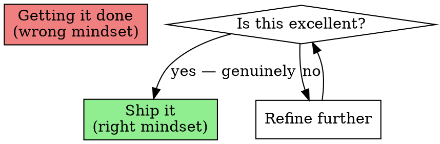
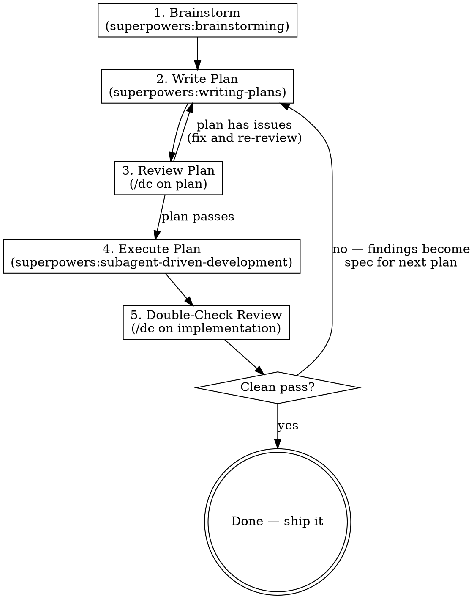

# Jack It Up

Iterative development cycle that prioritizes getting it right over getting it done. Each phase builds on the last, and review cycles continue until the work scores a 10/10 — not just functional, but polished.

## The Mindset

The goal is NOT to finish the work. The goal is to do the work perfectly.

Be inquisitive, not just task-completing. Ask "is this the best way?" at every stage. This is NOT scope creep — it is thoroughness. The difference: scope creep adds features nobody asked for; thoroughness ensures the requested features work flawlessly.

## Red Flags — Stop and Refocus

These thoughts mean the work is drifting toward "just get it done":

| Thought | What to do instead |
|---------|-------------------|
| "This is good enough" | Run /dc. If it finds issues, it's not good enough. |
| "Let me skip the review, it's simple" | Simple things break in subtle ways. Review it. |
| "I'll fix that later" | Fix it now. "Later" means "never." |
| "The tests pass, we're done" | Tests passing is the minimum. Review quality, not just correctness. |
| "This review cycle is overkill" | The review found issues last time. Trust the process. |

## The Cycle

### Phase 1: Brainstorm

**REQUIRED SUB-SKILL:** `superpowers:brainstorming`

Explore the user's intent, requirements, and design space before touching code. Do not assume the first idea is the right one. Ask questions. Challenge assumptions. Consider alternatives.

Output: A clear understanding of what to build and why.

### Phase 2: Write Plan

**REQUIRED SUB-SKILL:** `superpowers:writing-plans`

Turn the brainstorm output into a concrete, task-by-task implementation plan with complete code, exact file paths, test commands, and commit messages. No placeholders. No "TBD."

Output: A plan document saved to `docs/superpowers/plans/`.

### Phase 3: Review the Plan

Invoke `/dc` (which auto-detects planning phase). The double-check review spawns reviewers and a pre-mortem analyst to stress-test the plan.

- If CRITICAL or MEDIUM issues found → fix the plan, re-review until clean.
- Do NOT proceed to execution with an unreviewed or failing plan.

Output: A reviewed, clean plan.

### Phase 4: Execute the Plan

**REQUIRED SUB-SKILL:** `superpowers:subagent-driven-development` (recommended) or `superpowers:executing-plans`

Implement the plan task by task. Each task follows TDD (test first, implement, verify). Commit after each task.

Output: Working implementation with passing tests.

### Phase 5: Double-Check Review

Invoke `/dc` (which auto-detects implementation/post-implementation phase). The review:

1. Captures ALL gaps, issues, and problems found across every lens
2. Documents findings as a structured list with file:line references and severity
3. Invokes `superpowers:writing-plans` to turn findings into a fix plan
4. Reviews that fix plan before presenting it

- If the review passes clean → done. Ship it.
- If findings exist → the fix plan becomes the input for a new Phase 4 (execute) → Phase 5 (review) cycle.

### The Loop

Phases 4 and 5 repeat until a clean pass. Each cycle:
- Narrows the issue space (fewer findings each round)
- Increases confidence (more lenses pass clean)
- Converges toward 10/10 quality

Do NOT declare "done" until the final /dc review passes with no CRITICAL or MEDIUM findings.

## When NOT to Use This

- **Trivial one-line fixes** — just make the change
- **Exploratory prototyping** — brainstorm is enough, skip the full cycle
- **User explicitly asks for speed over quality** — respect the request

## Integration with /dc

The `/dc` skill already implements the findings-to-plan pipeline for implementation reviews (Phase 5). This skill orchestrates the full cycle around it. When `/dc` produces a reviewed fix plan, this skill picks it up and executes it, then runs `/dc` again.
